```{r setup, include=FALSE}
knitr::opts_chunk$set(echo = FALSE)

# Learn more about creating blogs with Distill at:
# https://rstudio.github.io/distill/blog.html

```

>This post was written as part of requirements for Visual Analytics course in MITB.

## 1. Introduction
For many countries, Singapore serves as an important port for trades and also heavily rely on imported goods for the country's usage. Trades primarily consist of imports and exports, where imports refer to goods brought into Singapore irrespective of the uses, while exports refer to goods brought out of the country. In order to understand the movement of goods in Singapore, data visualization is important to help us discover meaningful insights that could potentially drive better decision-making and improvement of Singapore's trades.

In this post, the original visualization chart of Singapore's Merchandise Trade from [_SingStat_](https://www.singstat.gov.sg/find-data/search-by-theme/trade-and-investment/merchandise-trade/latest-data) will be critically reviewed and an improved alternative design will be proposed.

## 2. Evaluation

The original chart is as shown below, and it mainly consists of top 6 trading countries between a time period of 2019-2021. The graphs were plotted based on their exports and imports across the time period.

```{r, out.width='25%', fig.align='center', fig.cap='Original Chart'}
knitr::include_graphics('img/originalchart.png')
```

Before evaluating the chart, primary research on the visualization was conducted in order to understand what are the purposes of this graph as well as key takeaways for the readers.

* **Audience:** Government Agencies, policy-makers, businesses and individuals
* **Purpose:** To have a clear overview on changes in trade volume (between exports and imports) of Singapore and its top 6 countries between 2019 to 2021, especially since it was during the Covid-19 pandemic.


### 2.1 Clarity

S/N | Critique | Approach
----| ---------|----------
1   | Cell 3   |
2   | Cell 4   |


### 2.2 Aesthetics


## 3. Proposed Visualization Design

### 3.1 Sketched Design


### 3.2 Advantages of New Design


## 4. Step-by-Step Methodology

### 4.1 Data Source

The raw excel data was downloaded from SingStat, and a preview of how the data looks like is shown below. 

```{r, out.width='25%', fig.align='center', fig.cap='Singapore Exports from 1976'}
knitr::include_graphics('img/exports_excel.png')
```

```{r, out.width='25%', fig.align='center', fig.cap='Singapore Imports from 1976'}
knitr::include_graphics('img/imports_excel.png')
```

As observed, the data was dated back from 1976 till 2021 in monthly basis. There are also many missing data (represented by "na") and unnecessary top few rows.

### 4.2 Data Preparation

To facilitate ease of data preparation, the raw dataset will first be uploaded onto **Tableau Prep Builder** for data selection. The steps noted below are based on table T1 (Imports Table), but the same steps can be applied for table T2 (Exports Table) as well.

S/N | Tableau Prep Builder Description 
----| ---------
1 | {width=500px} <br/>Click on _"Connect data"_, followed by _"Microsoft Excel"_ to upload the raw dataset.
2 | {width=500px} <br/>Drag table T1 into the empty pane.<br/>{width=600px} <br/>Notice that Tableau did not capture the headers and variables properly, hence we can click on _"Use Data Interpreter"_ at the left side of the page. <br/>{width=600px} <br/>The final preview of the table shows the proper table inputs and field names.
3 | Now, we can create a workflow for filtering of the data based on relevancy.<br/>{width=400px} <br/>At the top of the page, click on the "+" sign and select _"Clean Step"_.<br/> {width=600px} <br/>The preview will now show the interpreter data table.
4 | Since the original chart only focuses on top 6 countries, we should filter the countries accordingly too.<br/> {width=500px} <br/>At the variables column, select the _"More Options"_, followed by _"Filter"_ and _"Selected Values"_. <br/> {width=500px} <br/>We will then select the countries accordingly (including the total trades) as shown in the diagram above.
5 | In addition, the data of interest ranges from 2019-2021. Hence, we will select only the fields from "2019 Jan" to "2021 Apr" and remove the rest using the _"Remove Fields"_ button on top. <br/> {width=600px} <br/>The final preview of the table is as shown below. <br/>{width=600px} <br/>
6 | Finally, the table shows no "null" values and thus we can save this table into an external xlsx file for further exploration on **Tableau Desktop**. <br/>{width=500px} <br/>At the top, click on the "+" sign and select _"Output"_. <br/> {width=500px} <br/> Select _"xlsx"_ as the output type and navigate to the directory where you wish to save the file at.


Repeat the same steps as above for the Export Table. For easier reference, we shall combine both Imports.xlsx and Exports.xlsx into one excel worksheet before uploading into **Tableau Desktop**.


S/N | Tableau Desktop Description 
----| ---------
1 | Import the dataset into Tableau Desktop and drag the tables into the empty space as shown below. <br/>{width=500px} <br/>
2 | To facilitate cross-referencing in the graphs later, we will create a _"Relationship"_ between the 2 tables. We will first select _"Variables"_ as the relation. <br/>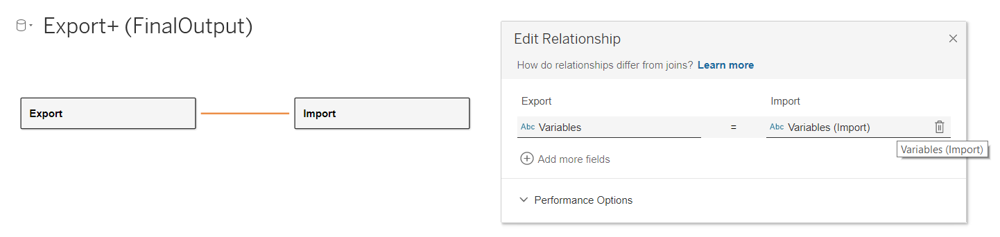{width=600px} <br/>After creating the relation, the output will look like the diagram below. <br/>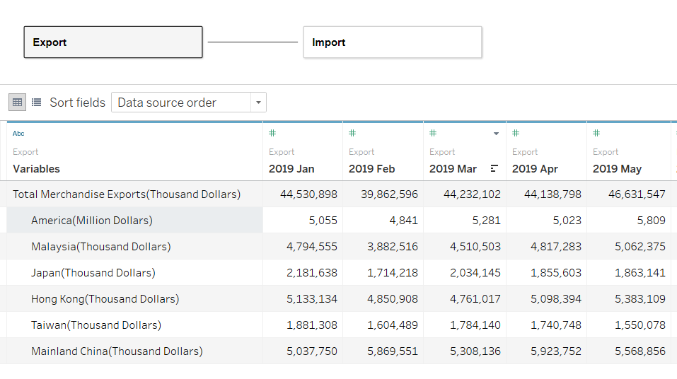{width=500px} <br/>
3 | Next, we will make the dates as rows by pivoting for both Import and Export tables. Select all the dates and right click followed by _"Pivot"_. <br/>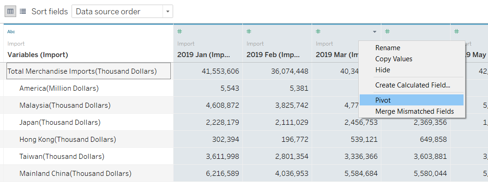{width=550px} <br/>The table will now look like this: <br/>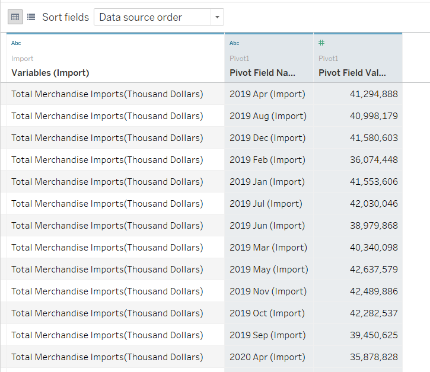{width=500px} <br/>We will then rename the column names accordingly for easier reference, as shown below. <br/>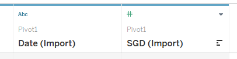{width=400px} <br/>
4 | Notice that the dates are in strings data type based on the tiny label _"Abc"_ on the top left corner at the columns. In this case, we will convert the data type into _"Date"_ format in both Export and Import. <br/>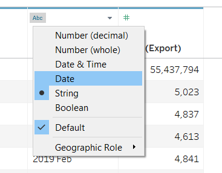{width=400px} <br/>
5 | In addition, we can see that only America is expressed in Million Dollars (SGD), hence we will convert the rest into the same units (Million Dollars) since the numbers are relatively large. Select the values column and right click on the _"Calculated Field"_ function. <br/>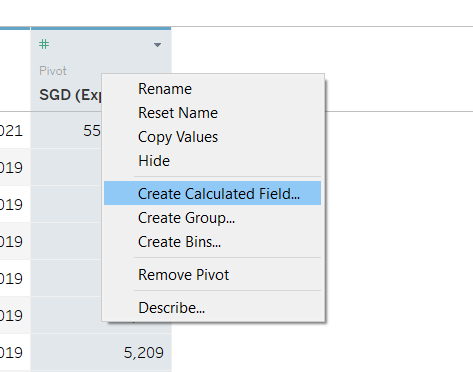{width=400px} <br/> Based on a brief scan across the table, it shows that America values are less than 5 figures, hence we can enter the syntax as this: <br/>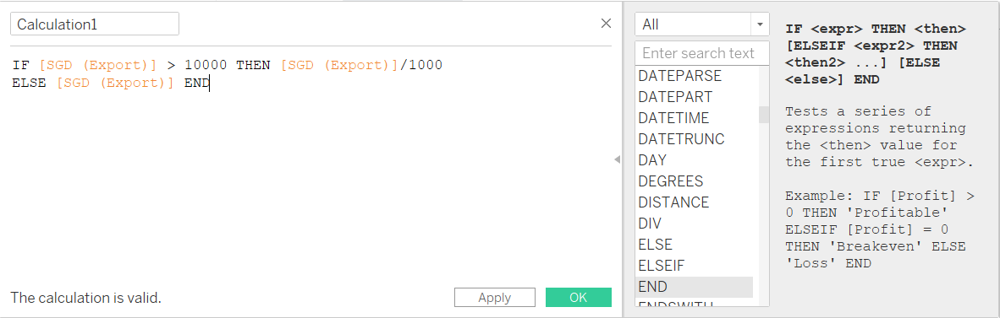{width=600px} <br/>After applying the changes, our table values now looks better. We shall rename the column names as well as shown below <br/>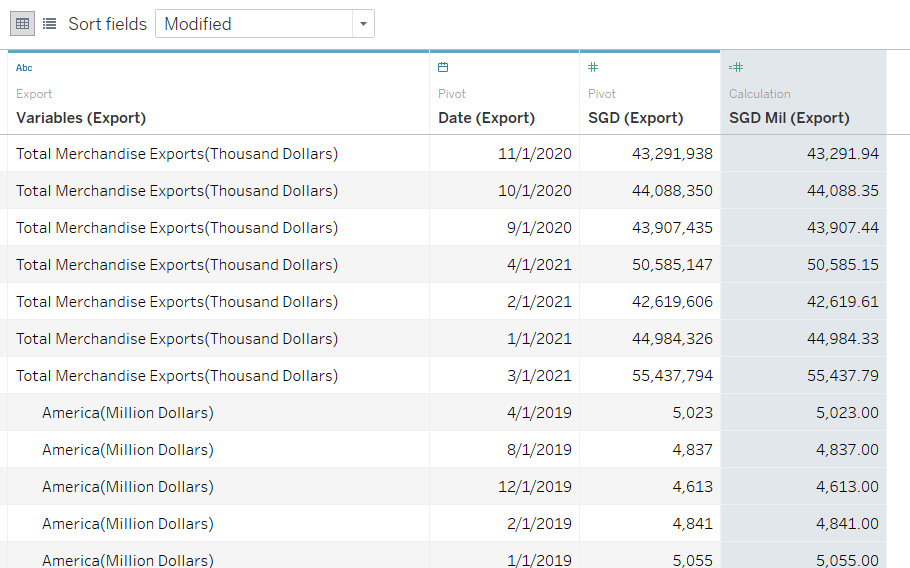{width=550px} <br/><br/>Repeat these steps for the other table.<br/>
6 | Now, we will rename the variables to make it shorter and easier to read. Select the variables column and right click on _"Aliases"_.<br/>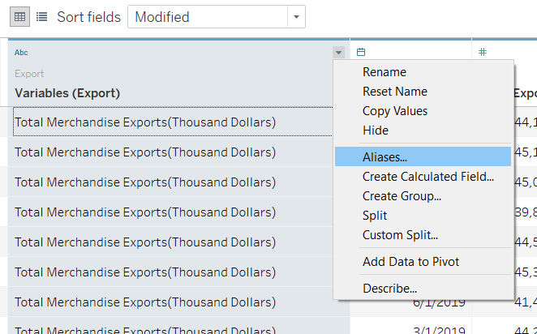{width=500px} <br/>A second window will pop up, and double click on the _"Value (Alias)" to edit the names accordingly. <br/>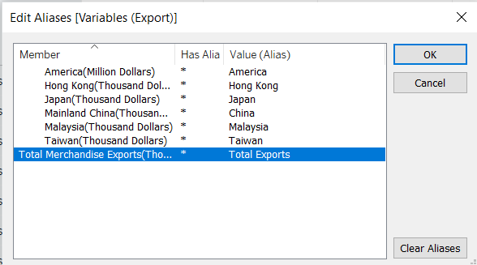{width=550px} <br/>
7 | Since the dates have been pivoted, it will now be easier to create a relationship between the tables. Click on the line joining both tables and edit the relationship accordingly. <br/>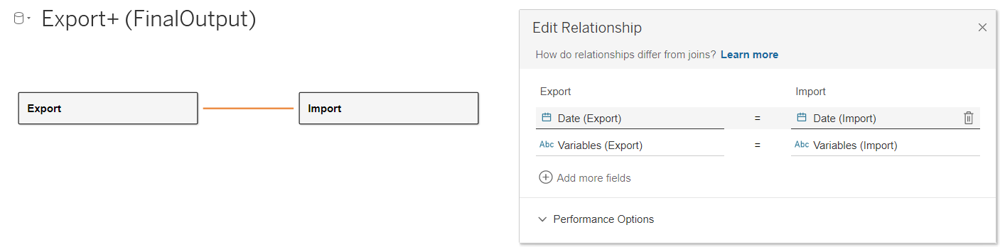{width=550px} <br/> The final overview of the tables should look something like this: <br/>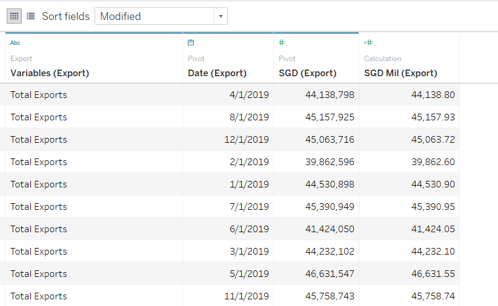{width=550px} <br/>


The tables are now ready to be used for constructing of visualizations.


### 4.3 Data Visualization (First Chart)

Overall comparison between Exports and Imports


### 4.4 Data Visualization (Second Chart)


### 4.5 Dashboard


## 5. Final Visualization

3 Main Observations


