```{r setup, include=FALSE}
knitr::opts_chunk$set(echo = FALSE)

# Learn more about creating blogs with Distill at:
# https://rstudio.github.io/distill/blog.html

```

>This post was written as part of requirements for Visual Analytics course in MITB.

## 1. Introduction
For many countries, Singapore serves as an important port for trades and also heavily rely on imported goods for the country's usage. Trades primarily consist of imports and exports, where imports refer to goods brought into Singapore irrespective of the uses, while exports refer to goods brought out of the country. In order to understand the movement of goods in Singapore, data visualization is important to help us discover meaningful insights that could potentially drive better decision-making and improvement of Singapore's trades.

In this post, the original visualization chart of Singapore's Merchandise Trade from [_SingStat_](https://www.singstat.gov.sg/find-data/search-by-theme/trade-and-investment/merchandise-trade/latest-data) will be critically reviewed and an improved alternative design will be proposed.

## 2. Evaluation

The original chart is as shown below, and it mainly consists of top 6 trading countries between a time period of 2019-2021. The graphs were plotted based on their exports and imports across the time period.


Before evaluating the chart, primary research on the visualization was conducted in order to understand what are the purposes of this graph as well as key takeaways for the readers.

* **Audience:** Government Agencies, policy-makers, businesses and individuals
* **Purpose:** To have a clear overview on changes in trade volume (between exports and imports) of Singapore and its top 6 countries between 2019 to 2021, especially since it was during the Covid-19 pandemic.

### 2.1 Clarity

S/N | Critique | Approach
----| ---------|----------
1 | Wrong choice of graph type (original chart uses area graph), as this causes overlapping and makes it difficult to read the values | Change the graph type to either bar chart or line chart to show distinct changes. Additionally, plot the imports and exports separately so as to have a clearer view for each type of trade.
2 | The overlapping of area graph introduces a new color, which is also not included in the legend properly.| Ensure all variables are labeled/annotated/represented properly in the chart.
3 | Values in Axes on both ends have different units, thus making it hard to read | Synchronize the axis and convert all values for imports and exports to the same units.
4 | Inconsistent representation of the time period among all countries. Japan has only time period of 2020, while the rest consists of trades from 2019-2020. This reduced the accuracy in the comparison between all 6 countries. | Clean up data and re-organize it to make sure ALL countries' data are included.
5 | Legend title is named as "Measure Names", which is clearly misleading. | Naming of the legends need to be edited properly.
6 | The title of each graph is just the country names, but does not annotate what the graph actually means. | Include a clear title that summarizes the whole plot.

### 2.2 Aesthetics

S/N | Critique | Approach
----| ---------|----------
1 | Size of all 6 charts are relatively small and hard to read. | This might be due to each country being plotted separately, hence we will combine all to make into a single plot of same axis.
2 | Font size used in the Chart Header is almost as big (or smaller) as the headings for each graph. | Bold the chart header and use a bigger font size to represent the main objective of the graph.
3 | Many blank areas and chart design is too "empty". | Fill in the white spaces with some descriptions/captions/annotations, and also highlight any key features for the readers to take note of (eg. using different colours to represent increase/decrease)

## 3. Proposed Visualization Design

### 3.1 Sketched Design

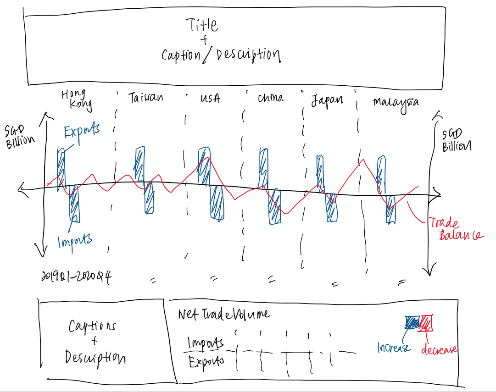

### 3.2 Advantages of New Design

* There will be a clear title for the overall chart, including the 2 plots as well. Axes and legends will also be labeled properly. This will thus let the readers have a clearer understanding of the plots.

* There will also be a few short captions/descriptions for the charts. This will thus provide more context to the overall plots.

* In this new design, we will be able to see the distinct changes in exports and imports trade volume per country on the same plot. There won't be any overlaps and thus making it easy to read.

* As the imports and exports are all on the same chart, the timeline used will also be consistent for fair comparison. The axes will also be synchronized across all countries and converted to a better unit of measurement (SGD Billion) so that the numbers will not be too big for reading.

* The use of colours will be introduced into the chart to highlight certain areas as well as showing of notable features.

## 4. Step-by-Step Methodology

### 4.1 Data Source

The raw excel data was downloaded from SingStat, and a preview of how the data looks like is shown below. 

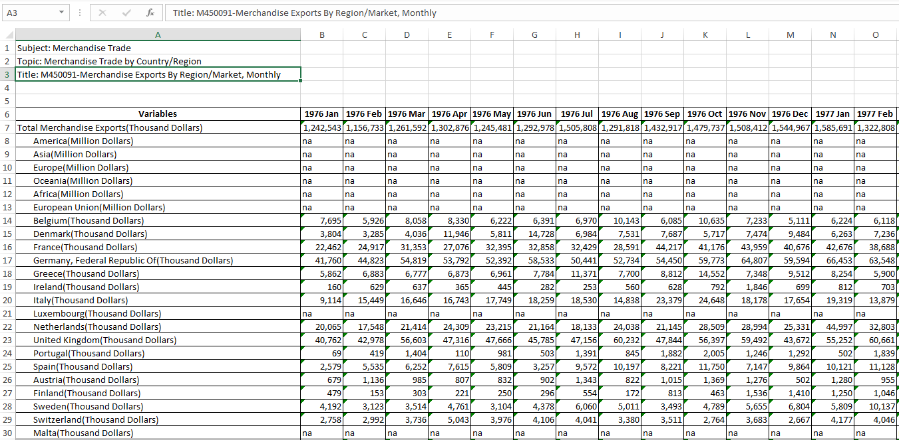

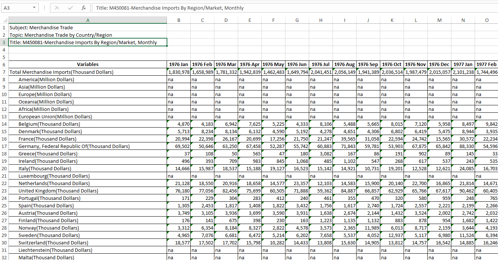

As observed, the data was dated back from 1976 till 2021 in monthly basis. There are also many missing data (represented by "na") and unnecessary top few rows.

### 4.2 Data Preparation

To facilitate ease of data preparation, the raw dataset will first be uploaded onto **Tableau Prep Builder** for data selection. The steps noted below are based on table T1 (Imports Table), but the same steps can be applied for table T2 (Exports Table) as well.

S/N | Tableau Prep Builder Description 
----| ---------
1 | 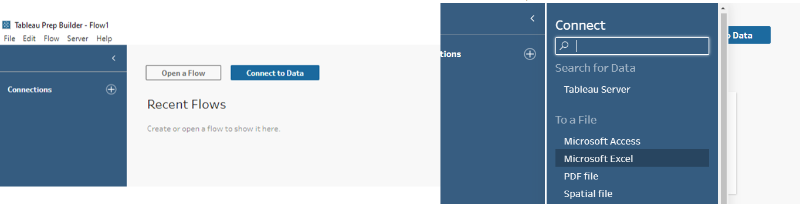{width=500px}<br/>Click on _"Connect data"_, followed by _"Microsoft Excel"_ to upload the raw dataset.
2 | 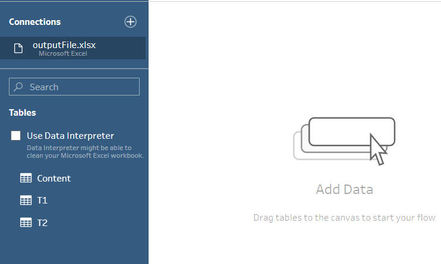{width=500px}<br/>Drag table T1 into the empty pane.<br/>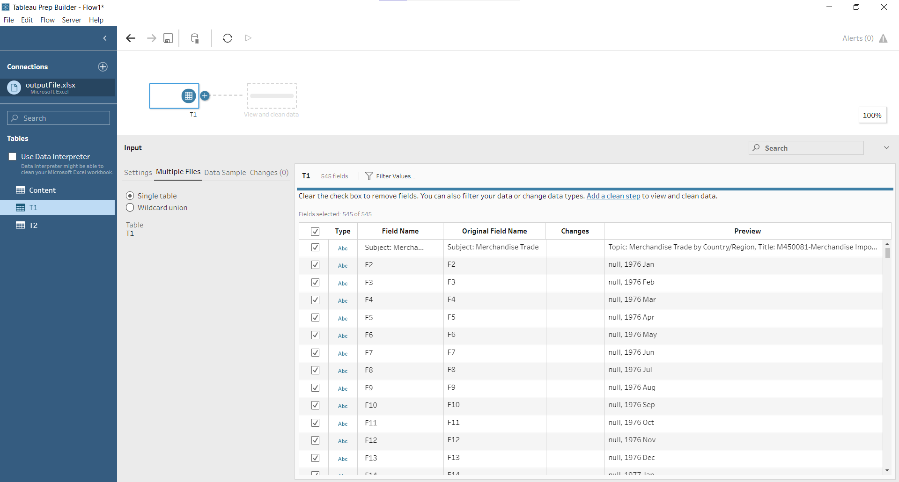{width=600px}<br/>Notice that Tableau did not capture the headers and variables properly, hence we can click on _"Use Data Interpreter"_ at the left side of the page. <br/>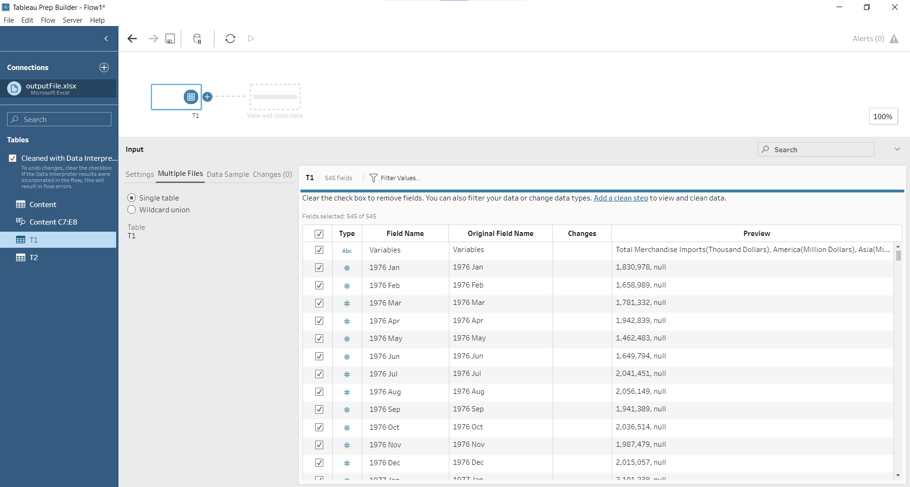{width=600px}<br/>The final preview of the table shows the proper table inputs and field names.
3 | Now, we can create a workflow for filtering of the data based on relevancy.<br/>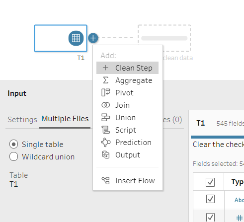{width=400px}<br/>At the top of the page, click on the "+" sign and select _"Clean Step"_.<br/>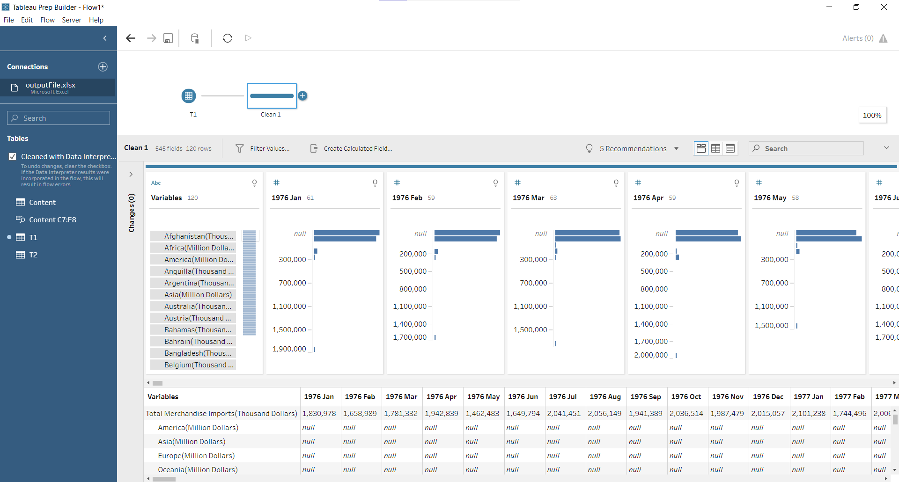{width=600px}<br/>The preview will now show the interpreter data table.
4 | Since the original chart only focuses on top 6 countries, we should filter the countries accordingly too.<br/> 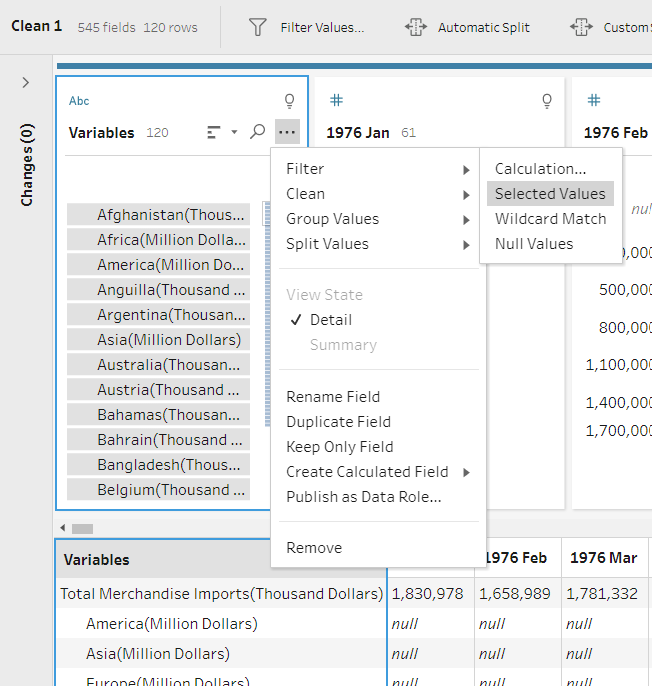{width=500px}<br/>At the variables column, select the _"More Options"_, followed by _"Filter"_ and _"Selected Values"_. <br/>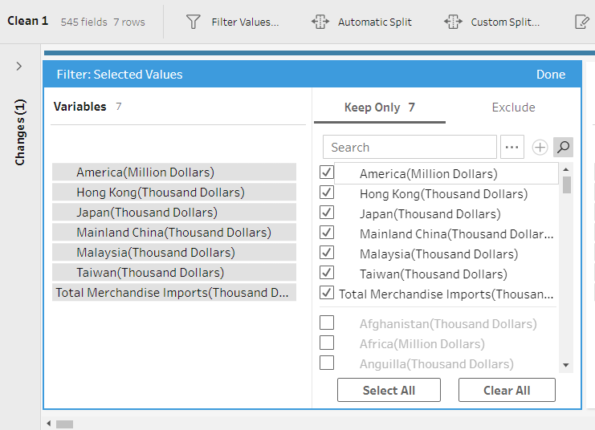{width=500px}<br/>We will then select the countries accordingly (including the total trades) as shown in the diagram above.
5 | In addition, the data of interest ranges from 2019 onwards. Hence, we will select only the fields from "2019 Jan" to "2021 Apr" and remove the rest using the _"Remove Fields"_ button on top. <br/>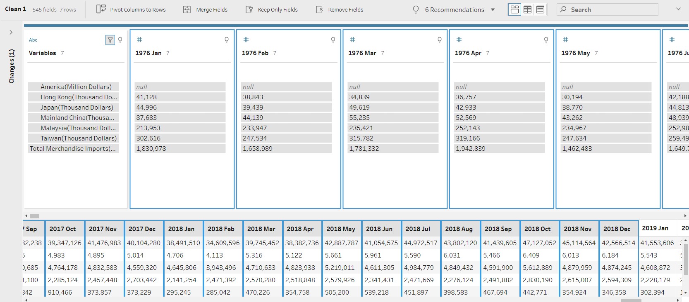{width=600px} <br/>The final preview of the table is as shown below. <br/>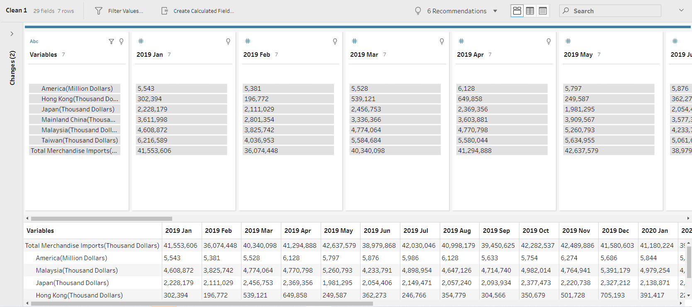{width=600px} <br/>
6 | Finally, the table shows no "null" values and thus we can save this table into an external xlsx file for further exploration on **Tableau Desktop**. <br/>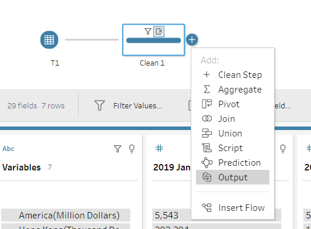{width=500px}<br/>At the top, click on the "+" sign and select _"Output"_. <br/> 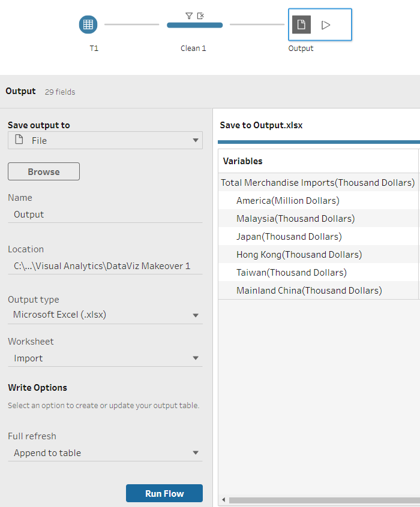{width=500px} <br/> Select _"xlsx"_ as the output type and navigate to the directory where you wish to save the file at.

<center>


</center>

Repeat the same steps as above for the Export Table. For easier reference, we shall combine both Imports.xlsx and Exports.xlsx into one excel worksheet before uploading into **Tableau Desktop**.

S/N | Tableau Desktop Description 
----| ---------
1 | Import the dataset into Tableau Desktop and drag the tables into the empty space as shown below.<br/>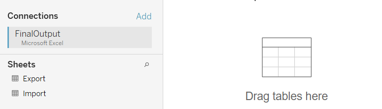{width=500px}<br/>
2 | To facilitate cross-referencing in the graphs later, we will create a _"Union"_ between the 2 tables. Click on the _"New Union"_ at the side bar and drag in both Import and Export tables.<br/>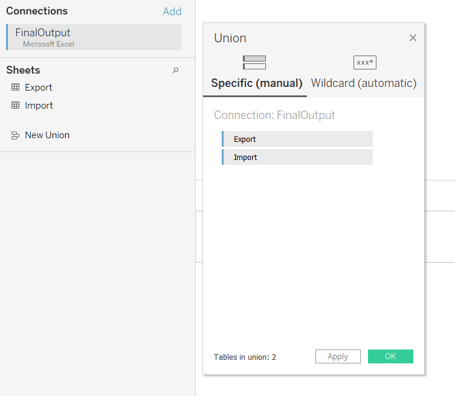{width=400px} <br/>Click _"ok"_ and the output will look like the diagram below, which both tables values together. <br/>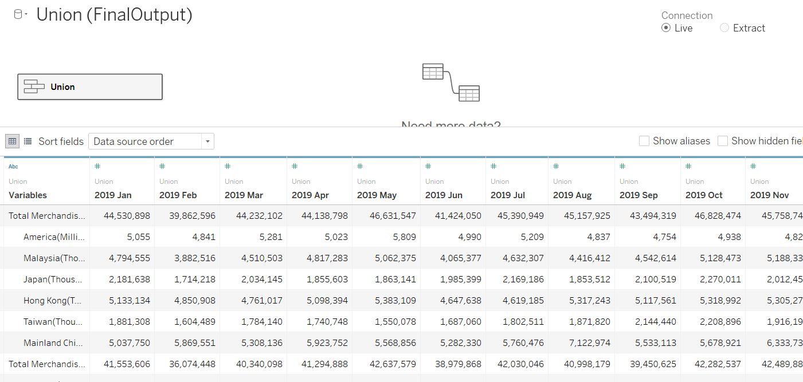{width=600px} <br/>
3 | Next, we will make the dates as rows by pivoting for the table. Select all the dates and right click followed by _"Pivot"_. <br/>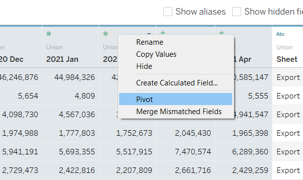{width=500px} <br/>The table will now look like this: <br/>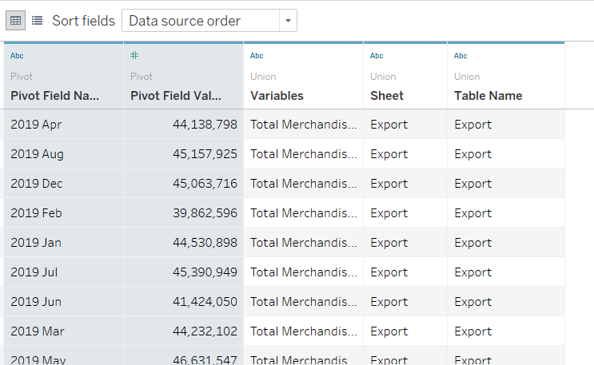{width=500px} <br/>We will then rename the column names accordingly by double clicking at the headers for easier reference. <br/>
4 | Notice that the dates are in strings data type based on the tiny label _"Abc"_ on the top left corner at the columns. In this case, we will convert the data type into _"Date"_ format in both Export and Import. <br/>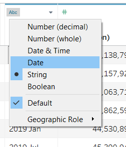{width=300px} <br/>
5 | We can also change the data type of the Variables column from strings to country, as it might be easier for us to conduct geospatial mapping later. To do so, click on the _"Abc"_ logo again and hover on the _"Geographical role"_ to select on _"Country/Region"_. <br/>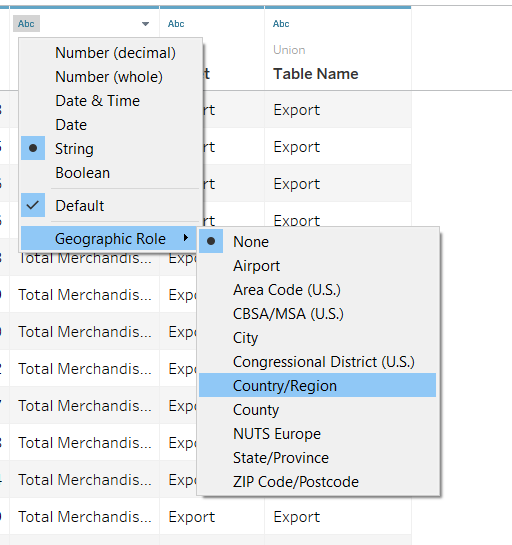{width=400px} <br/>
6 | In addition, we can see that only America is expressed in Million Dollars (SGD), while the rest are in Thousands. Hence, we will convert all the values into the same units (Billion Dollars) since the numbers are relatively large. Select the values column and right click on the _"Calculated Field"_ function. <br/>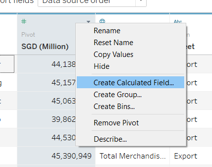{width=400px} <br/> Based on a brief scan across the table, it shows that America values are less than 5 figures, hence we can enter the syntax as this: <br/>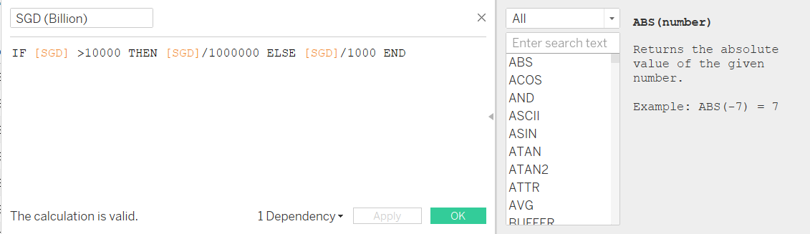{width=600px} <br/>After applying the changes, our table values now looks better. We shall rename the column names as well. <br/>
7 | Now, we will rename the variables to make it shorter and easier to read. Select the variables column and right click on _"Aliases"_.<br/>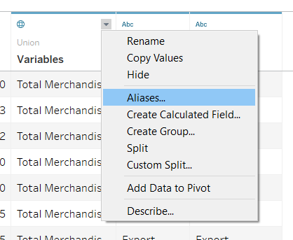{width=450px} <br/>A second window will pop up, and double click on the _"Value (Alias)" to edit the names accordingly. <br/>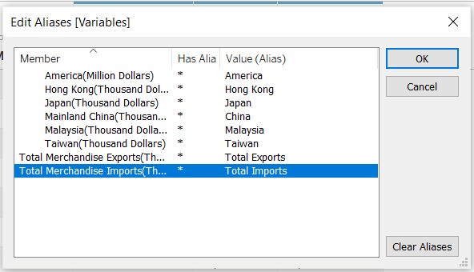{width=550px} <br/>
8 | After all the above steps, the final overview of the tables should look something like this: <br/>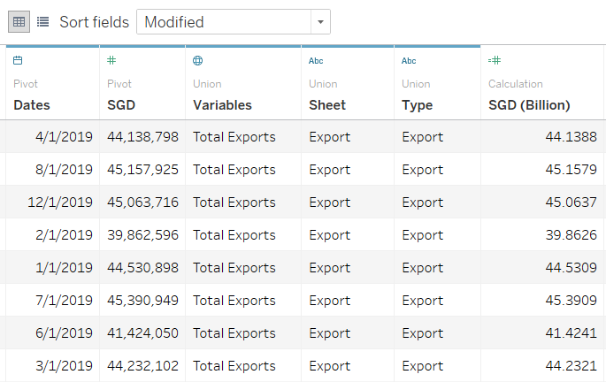{width=600px} <br/>

<center>


</center>

The table is now ready to be used for constructing of visualizations.

### 4.3 Data Visualization (First Chart: Trade Volume and Balance)

In this first chart, we will be creating a line and bar chart congregated onto a single axis for an easier overview in both trade volumes and balance between exports and imports.

#### Setting up of Plot

1. Open up the first sheet tab of Tableau, and we can see the Tables Pane like this: 

<center>

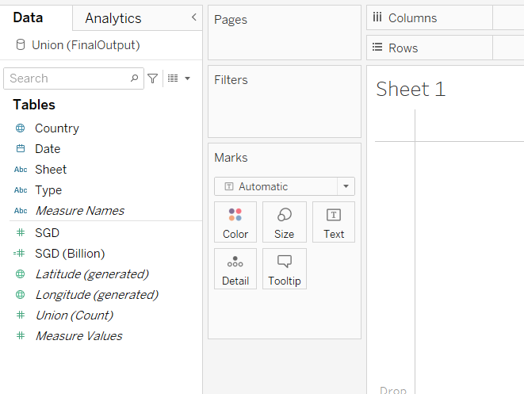{width=70%}

</center>

2. Drag variables "Country", "Date" and "SGD (Billion)" into the _"Columns"_ and _"Rows"_, and you can see the plot as follows: 

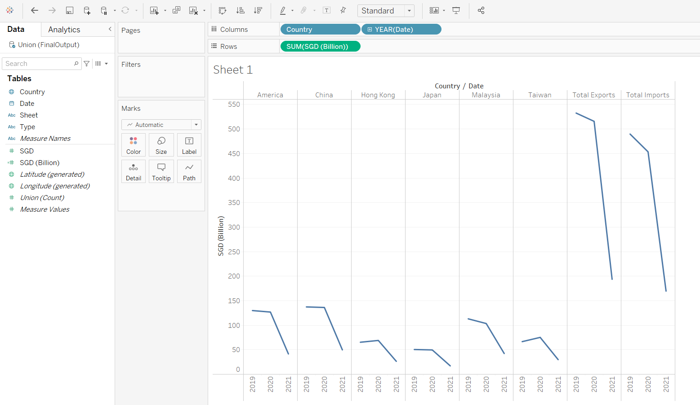

3. Note that the date of interest is from 2019-2020, and only the top 6 countries to be selected. Hence, we will do a _"Filters"_, by dragging in "Country" and "Date" into the section. We will de-select on "Total Exports" and "Total Imports" for the "Country", while de-selecting "2021" option in the Years for "Date". We will then click on _"Apply"_ and the changes will occur accordingly.

<center>

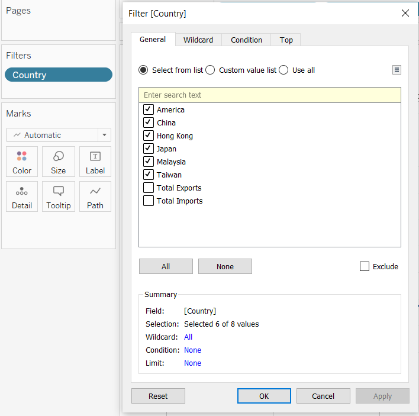{width=60%}

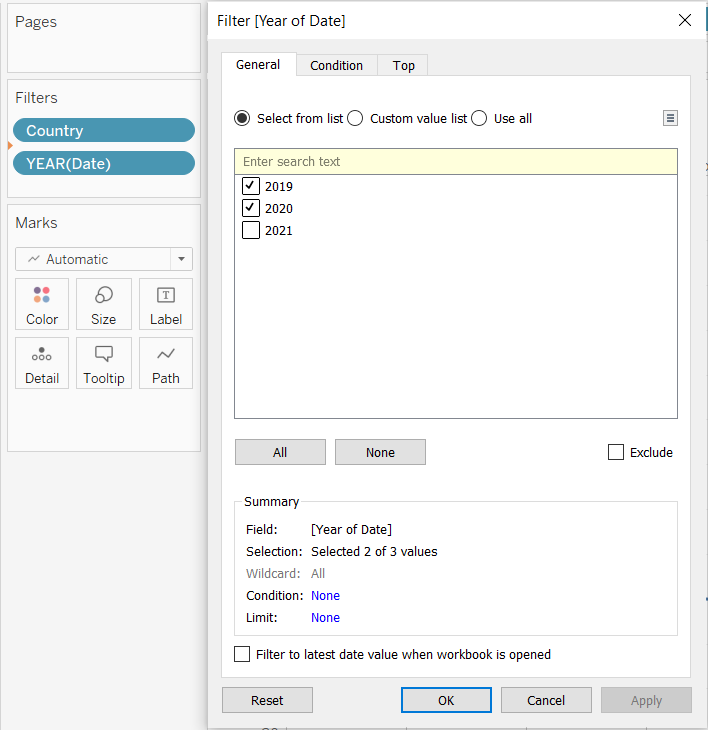{width=60%}

</center>

4. Next, we will change the graph into a bar chart by selecting it from the _"Marks"_ pane. We will also change the formatting for "Date" from the drop down, and als click on the "+" sign next to "Date" again to display the quarters as well. Hence, the steps and plot becomes like this: 

<center>

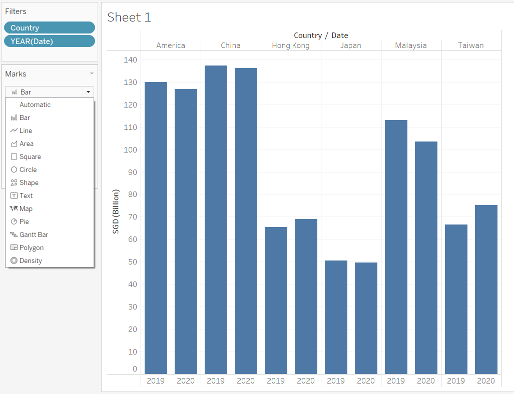{width=60%} 

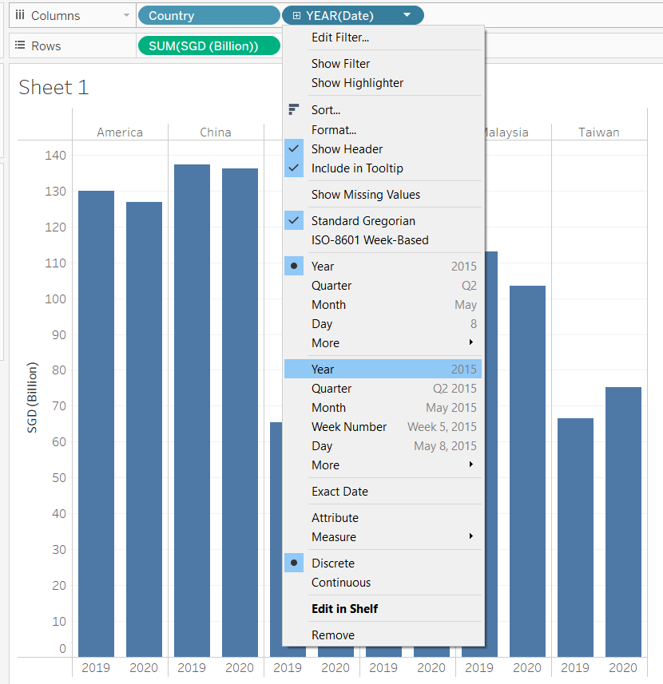{width=60%} 

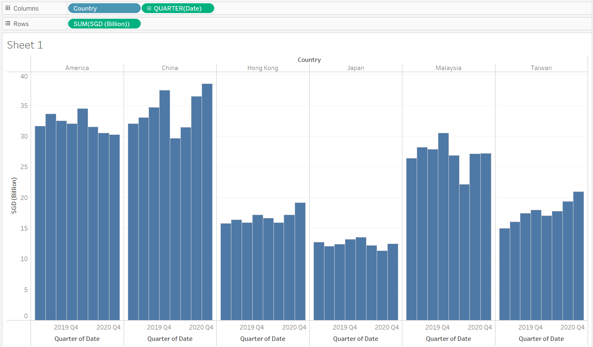{width=80%} 

</center>

5. In order to plot both exports and imports on the same axis, we have to create a calculated field (right click at the left pane) as shown below in Figure 4.3.8. 
    + We will then replace the variables in the rows, from "SGD (Billion)" to the new calculated field "Balance".
    + After that, drag the "Type" variable into the "Color" at Marks pane and we will get the diverging graph as seen in Figure 4.3.10.

<center>

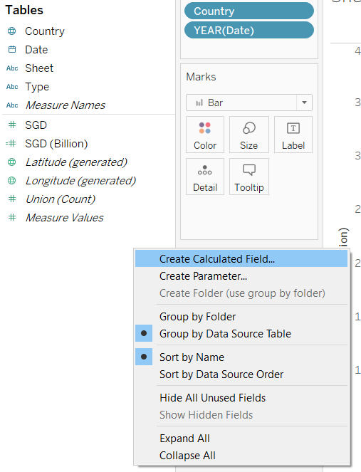{width=50%}

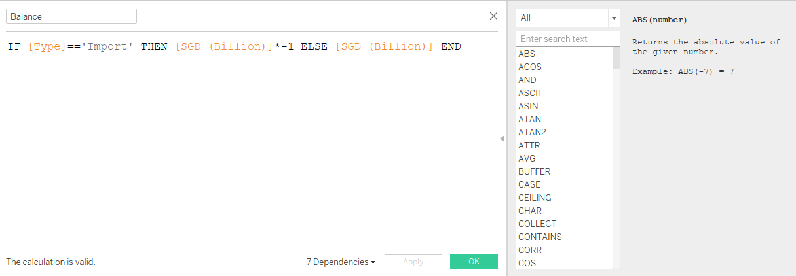 

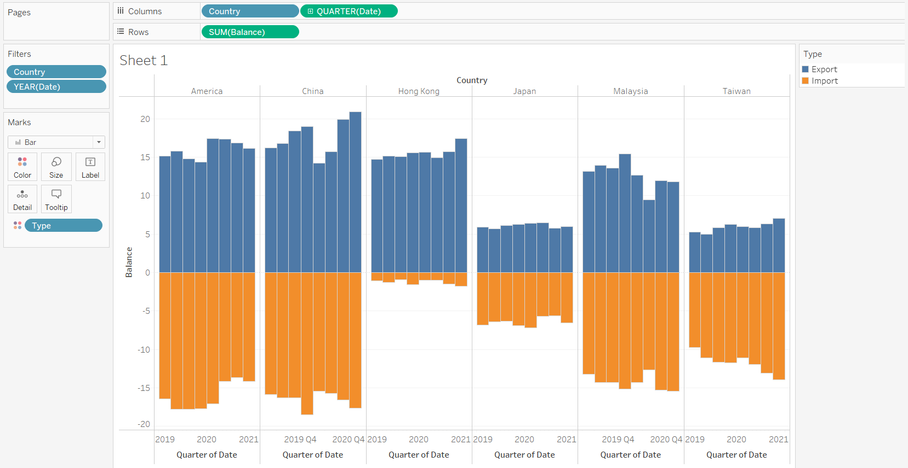

</center>

6. Now, we will add in the line graph that calculates the trade balance onto the same plot. 
    + Drag the "Balance" variable into the rows and change it into a line graph.Then, right click on the botton axis and click on "Dual Axis". 
    + We will also synchronize the axis to re-organize the chart by right clicking the axis. 
    + In case the line graph doesn't show, we can realign the order by formatting the axis and selecting the marks to be brought forwards. 
    + Viola! We have our combined diverging chart ready! You can change the colours of the lines/bar graph to make it more prominent.

<center>

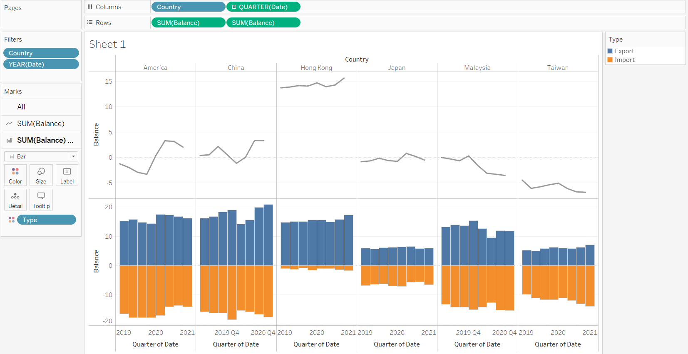 

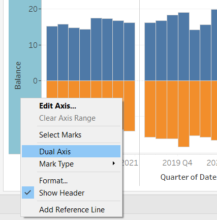{width=50%} 

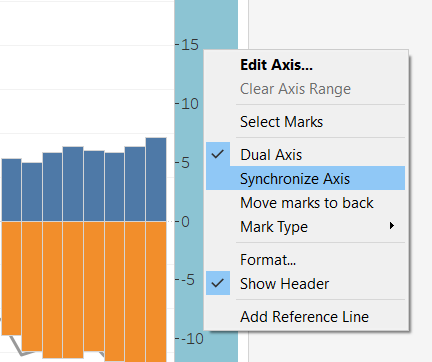{width=50%} 

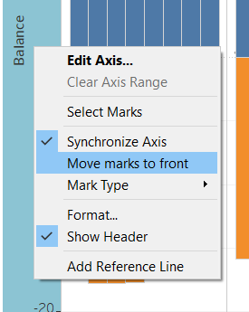{width=50%} 

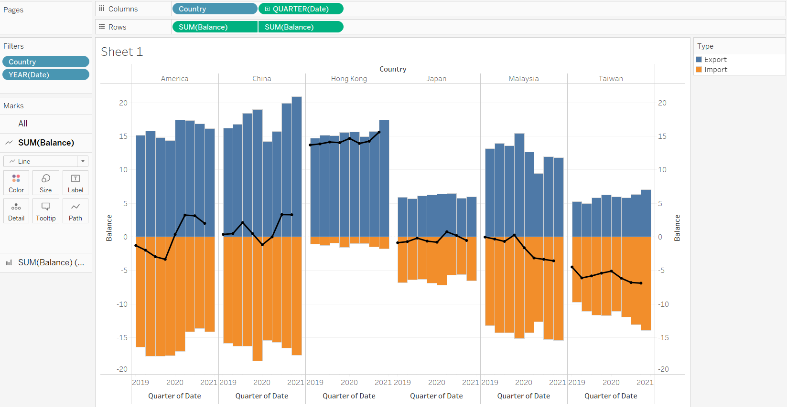

</center>

#### Customization

To distinguish the important features of the graph, we will change the colours or formatting to make the features more prominent and pleasing to the eye. There are 4 main features to go about: <br/>

1. Editing the title of axes and adding in labels, markers:
    + Drag the "Balance" variable into the _"Label"_ portion at the Marks for line graph. 
    + Add in markers (under _"Color"_) to the lines for better identification.
    + Edit the axes title by double clicking it.

2. Change the colours of the bar chart to colours that are more pleasing to the eye.
    + Add in differentiating colours for negative and positive values in the trade balance by dragging "Balance" to _"Color"_ in the Marks pane. Edit the colors into 2 steps that centered at 0, as shown in Figure 4.3.16.

<center>

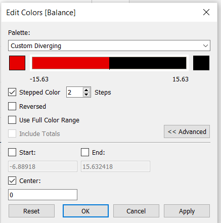{width=50%}

</center>

3. Changing the labels on the axis to positive values:
    + As imports are positive values originally, we will edit it accordingly on the axis. Firstly, right click on either axis, then click _"Format"_.
    + Under the _"Axis"_ section, select the _"Numbers"_, click _"Custom"_ and enter the format as shown below in Figure 4.3.17.
    
<center>

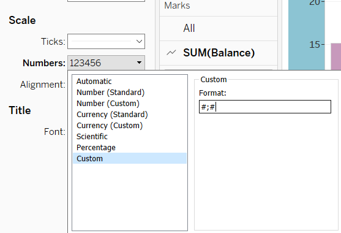{width=50%}

</center>

4. Edit the "Tooltip" to reflect the timeline, units, trade volume and balance.


After all the steps above, the final chart should look something like this: 

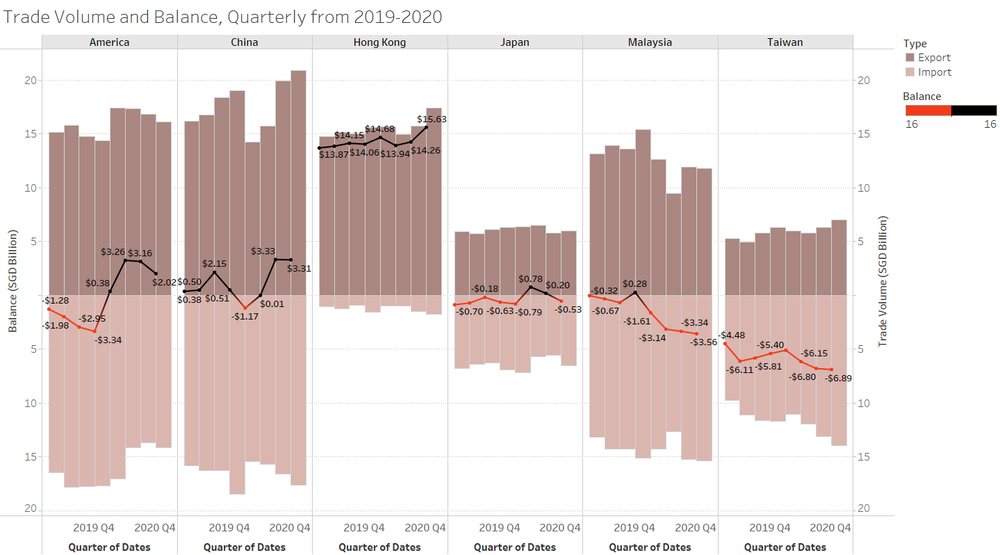{width=120%}

### 4.4 Data Visualization (Second Chart: Net Trade Volume)

This chart will be a simple visualization to the net exports and imports per year across the different countries.

#### Setting up of Plot

1. Open up an empty sheet and drag in "Country", "Date" to columns while "Type" into the rows. (Refer to top few steps if unsure) Leave the dates as yearly values.

2. As usual, filter the years to 2019-2020 and remove both "Total Exports" and "Total Imports".

3. Note that a table of missing values is now created, thus we will drag in "SGD (Billion)" to the _"Text"_ section in the Marks pane.

4. To create colours in visualizing the change of net trade volume, we will be switching to a highlight table instead. On the top right corner of the page, click on _"Show Me"_ and select the _"Highlight Table"_ as shown in the diagram below.

<center>

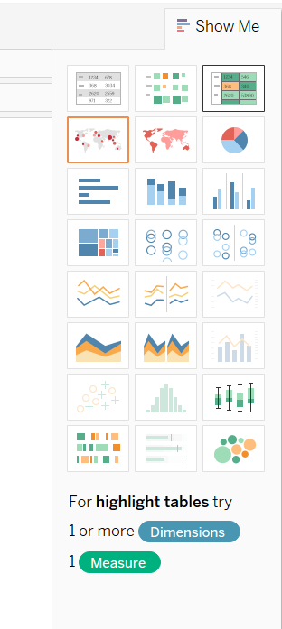{width=25%}

</center>

Great! Our second chart is almost done, just need to touch up on the colours and display!


#### Customization

Similar to the first chart, we would like our visuals to highlight the key features.

1. Change the colours of the table.
    + At the Marks pane, edit the "SGD (Billion)" under _"Colors"_ and compute using the difference across pane.
    + We will be using the full spectrum of the diverging colours by checking the "Use Full Color Range". 
    
<center>

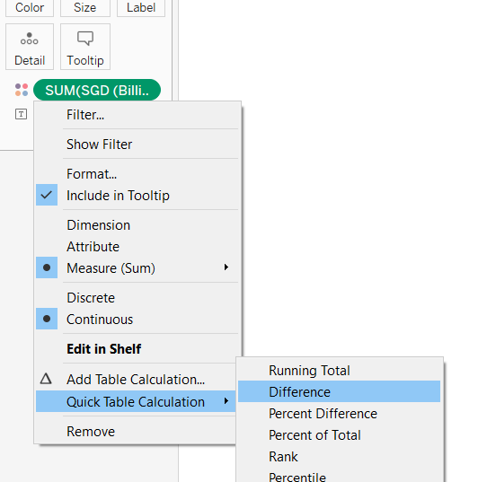{width=50%}

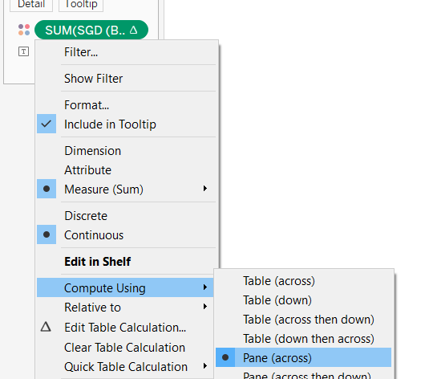{width=50%}

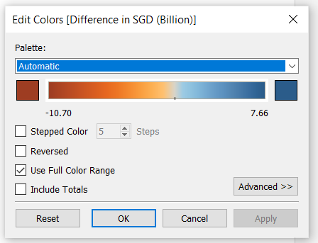{width=50%}

</center>

2. Adding in Subtotals and Grand Totals
    + To show the overall values, we can add in the totals by clicking onto the tab _"Analysis"_, followed by _"Totals"_ and selecting the _"Add All Subtotals"_ as well as _"Show Row Grand Totals"_.

<center>

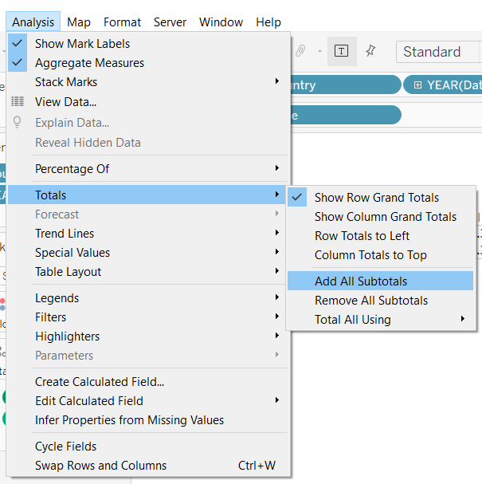{width=60%}

</center>

3. Rename the axes and title of the chart for better understanding. After all the steps above, the final chart should look something like this:

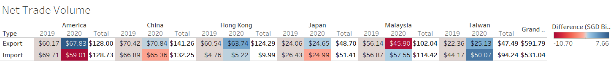{width=120%}

### 4.5 Dashboard

Finally, we can compile all the charts into the dashboard. 

1. First, open up an empty dashboard and set the size of it to _"Automatic"_. 

<center>

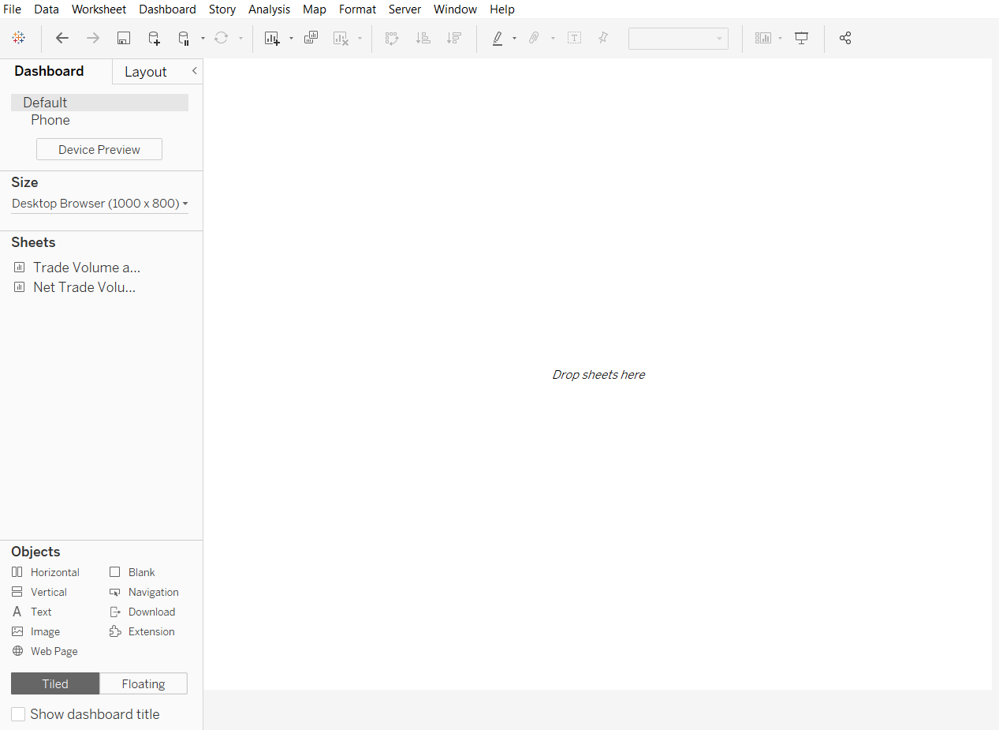{width=70%}

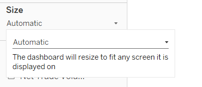{width=50%}

</center>

2. Drag in both sheets into the empty dashboard. Make sure to format the layout of all charts,legends and text into _"Floating"_. This will allow to resize and reorganize our dashboard easily to wherever we want.

<center>

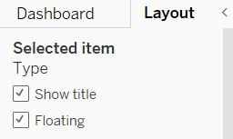{width=40%}

</center>

3. Include a header for the dashboard by checking the _"Show dashboard title"_.

<center>

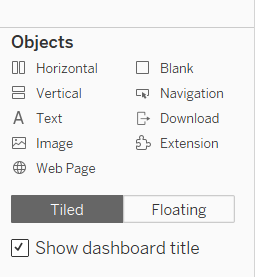{width=30%}

</center>

4. Include captions, text or description. To do so, drag the _"Text"_ object into the dashboard and format it to _"Floating"_. Edit the text accordingly to information or findings from the chart. 


## 5. Final Visualization

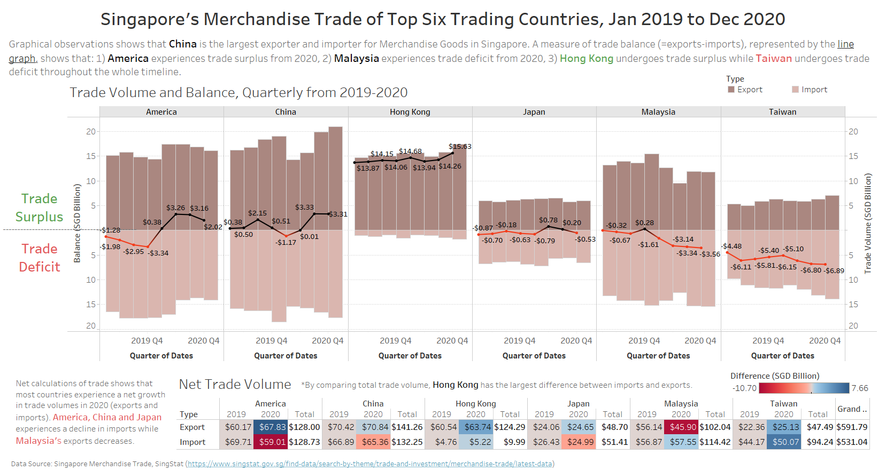{width=120%}

The dashboard can also be accessed [_HERE_](https://public.tableau.com/app/profile/lim.jiahui/viz/dataviz1_for_netlify/Dashboard1).


### Main Observations

1. From the graphs, we noticed that the main exporter/importer for Singapore's Merchandise Trade in 2019-2020 is **Mainland China**. The net calculations of trade volume between each year shows that **America** has the _steepest decline in import trades_, while **Malaysia** has the _steepest decline for export trades_.

2. The difference between exports and imports was also calculated, where it can be seen that **Hong Kong** has the largest difference between the two type of trades. The import volume is also extremely small compared to other countries.

3. Trade balance is an economical indicator of the country's growth, as it plays a part in influencing the value of currency in global markets as well creation of employment and economic growth. This indicator is measured by taking the **exports minus imports** volume. In this chart, the trade balance among the countries were plotted by the **line graph** across 2019-2020. With the _origin axis_ as a baseline, we observe that:
    + **Hong Kong** experiences _Trade Surplus_ throughout the entire time period, while **Taiwan** experiences a _Trade Deficit_ within the same time period.
    + Interestingly, **America** experiences _Trade Deficit_ in 2019, but managed to overturn the situation and enter _Trade Surplus_ in 2020. 


---
<center>

That's all for my dataviz makeover #1 post! Thanks for reading :)

</center>


#### References

* [International Monetary Fund, Singapore Merchandise Trade](https://dsbb.imf.org/sdds/dqaf-base/country/SGP/category/MET00)
* [Economics measurement of global trade](https://courses.lumenlearning.com/wmopen-introbusiness/chapter/measuring-global-trade/)
* [World Integrated Trade Solution - measuring trade balance](http://wits.worldbank.org/visualization/positiveandnegativemerchandisetradebalance.html)


