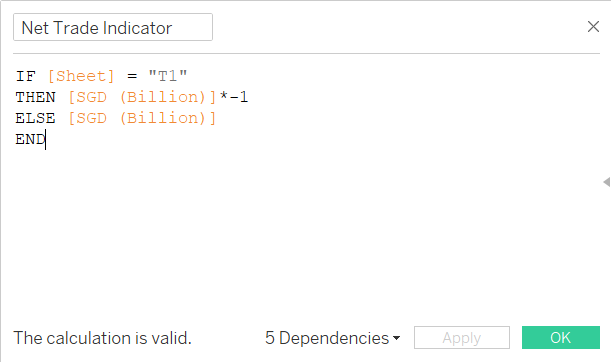

```{r setup, include=FALSE}
knitr::opts_chunk$set(echo = FALSE)
```

>This post was written as part of requirements for Visual Analytics course in MITB.

## 1. Introduction
For many countries, Singapore serves as an important port for trades and also heavily rely on imported goods for the country's usage. Trades primarily consist of imports and exports, where imports refer to goods brought into Singapore irrespective of the uses, while exports refer to goods brought out of the country. In order to understand the movement of goods in Singapore, data visualization is important to help us discover meaningful insights that could potentially drive better decision-making and improvement of Singapore's trades.

In this post, the original visualization chart of Singapore's Merchandise Trade from [_SingStat_](https://www.singstat.gov.sg/modules/infographics/singapore-international-trade) will be critically reviewed and an improved  alternate `interactive` design will be proposed.


## 2. Evaluation

The original chart is as shown below, where it consists of major trading regions (in picture shows top 10: China, Malaysia, United States, European Union, Taiwan, Korea, Japan, Indonesia, Thailand and Hong Kong) between a time period of January 2011 to December 2020.


Before evaluating the chart, primary research on the visualization was conducted in order to understand what are the purposes of this graph as well as key takeaways for the readers.

* **Audience:** Government Agencies, policy-makers, businesses and individuals
* **Purpose:** To have a clear overview on which markets are the major net importers and exporters, as well as visualize the total trading volume with Singapore. The trade values used will be between a fixed time period of 2011 to 2020. The visualization will be made interactive for selected views.


### 2.1 Clarity

S/N | Critique | Approach
----| ---------|----------
1 |  |
2 |  |

### 2.2 Aesthetics

S/N | Critique | Approach
----| ---------|----------
1 |  |
2 |  |

## 3. Proposed Visualization Design


### 3.2 Advantages of New Design


## 4. Step-by-Step Methodology

### 4.1 Data Source

We will be using the same datasets of "import.csv" and "export.csv" as [DataViz Makeover #1](https://limjiahui.netlify.app/posts/2021-05-21-dataviz-makeover-1/). 


### 4.2 Data Preparation

As the raw dataset consists of multiple unwanted rows, columns and 'NA' values, we will be doing some pre-processing on **Tableau Desktop**. For the purpose of this interactive visualization, we will be using all trading markets in the dataset.


```{r table2, echo=FALSE, message=FALSE, results='asis', warnings=FALSE}
tabl <- "
| Steps | Description   | 
|-----|:-------------:|
| 1 | Import the raw dataset into Tableau Desktop. From there, we can see 2 different tables - T1 and T2.<br/>{width=50%}{width=50%}<br/>Click on _New Union_ and drag both T1 and T2 and select _Apply_. |
| 2 | The data table will be stacked and it should look something like this: <br/>{width=100%}<br/> Notice that the structure of the table is wrong, thus we can click on _Cleaned with Data Interpreter_ at the side pane and it will automatically detect the exact table structure.<br/>{width=50%}<br/>The data table should now look like this:<br/><br/> | 
| 3 | We will now filter the dates to January 2011 to December 2020. Shift and hold to select all unwanted columns, right click and select _Hide_. <br/>{width=60%}<br/> |
| 4 |  To convert the date columns to rows, we will use the _Pivot_ function by right clicking the selected columns. <br/>{width=70%}<br/> We can then rename the pivoted columns accordingly. |
| 5 |  Then, we shall rename the variables to shorter words for simiplicity and uniformity. Initially, the namings of the regions are very long and inconsistent as shown below.<br/>{width=80%}<br/> As there are many regions, it will take alot of time to rename all individually. Hence, we shall use the split function in Tableau. <br/>{width=80%}<br/> Great! Now tableau has automatically seperate the units and the region names. At the top right hand of the column, click on the tiny triangle and select _Aliases_. <br/>{width=60%}<br/> <br/>{width=90%}<br/> Now, we can check through the namings and rename those longer ones to their acronyms or shorter version. <br/>**Note:** There are few regions that requires some prior knowledge and research before renaming, eg. Commonwealth of Independent States (CIS) is a group of states together, and Democratic People's Republic of Korea is North Korea. <br/> The final names should look like this: <br/>{width=90%}<br/> We shall rename this new column as 'Markets'. |
| 7 | Also, we can rename the _Table Name_ to 'Type' and change the aliases from T1 and T2 to Exports and Imports accordingly.<br/>{width=80%}<br/> |
| 8 | After _split_ function above, notice that the 2nd variable columns becomes like this: <br/>{width=80%}<br/> Hence, we shall filter those out to tidy up our table. At the top right corner of the page, click on _Add_ under _Filter_. <br/>{width=70%}<br/> Select _Variables Split 2_ and check on the Million and Thousand only. <br/>{width=70%}<br/> After that, click on Ok to apply. |
| 9 |  Note that the SGD values recorded are not consistent, where some are in SGD Millon Dollars, while the rest are in SGD Thousands. As the numbers are all big, we will standardize across all values to SGD Billion Dollars. Create a _Calculated Field_ from the mini triangle again. <br/>{width=60%}<br/> We can enter the following formula to the field using if-else function and click _Apply_. <br/>{width=90%}<br/> |
| 10 |  Lastly, we shall change the Data type for the Date, from strings to Datetime format. <br/>{width=50%}<br/> |
"

cat(tabl) # output the table in a format good for HTML/PDF/docx conversion
```

Viola! Our data is well-prepped and ready to be used for visual constructions.


### 4.3 Data Visualization (1st Chart)

For this first chart, we will be examining the net exports and imports trade value based on each individual markets, using a horizontal diverging lollipop chart. 

1. Open up a fresh empty worksheet, and drag _Markets_ into _Rows_ and _Filters_ pane. Because we want to compare between the markets individually, we will filter out the Total Exports and Imports, as well as the Continents (Europe, Asia, America, Oceania, Africa). The filters should look like below, and once all is selected properly, click on _Apply_.

<center>

{width=50%}

</center>

2. Next, we will create a calculated field to show the net trade values. Right-click onto the Data pane and click on _Create Calculated Field_. We will use an if-else function to multiply the SGD value to negative if it its imports (aka sheet = 'T1'). Hence, we can apply the formula as shown in Fig 4.3.3 and rename it to "Net Trade Indicator".


<center>

{width=50%}

{width=75%}

</center>


3. Now, drag the "Net Trade Indicator" into the _Columns_, and you can see a diverging bar chart already. In order to make it a lollipop shape, we have to use dual axis. Drag "Net Trade Indicator" again to columns to create this effect, but change the marks as "Circle" instead and thus it should look something like Fig 4.3.4. 

<center>


</center>


4. Now, lets join them together into one axis. Right click on the x-axis and select on _Dual Axis_. After that, remember to _Synchronize Axis_ so that the plots appear together in sync.


<center>

{width=30%}

{width=30%}

</center>


5. Note that after combining them, the shapes of the chart might be different. Do make sure that one of them is a circle, while the other is a bar graph. You can make the changes under the individual Marks pane (do not change the All marks pane!).

<center>

{width=30%}

</center>


6. Next, we shall alter the size and colour for the charts. For the lollipop shape, we need the bar graph to be very thin while the circle to be larger. We can make the necessary changes in its individual Marks pane as well, under _Size_ tab. We can also change the colours under _Color_ accordingly to make the stem and head more distinct. Once the changes has been made, we have achieved our lollipop shape!


<center>


{width=70%}

</center>


7. As the original purpose of the graph is to see Singapore's **Major** trading partners, we shall now create a parameter called "Top N Trading Partners". This parameter can also be used as a filter to change the N value based on what the viewer wish to see.
    + Right click at the Data Pane and select _Create Parameter_.
    + We shall create a list with integers from 5-20 with stepsize of 5.
    + In order to allow it to work as a filter for _Markets_ variable, we can edit the _Markets_ filter by navigating to the _Top_ tab and select the _By field_, changing it to the name of the parameter we just created.
    + As we are interested in filtering by **Total Sum of Imports and Exports value**, we can select that condition under _by_ drop down menu as well.


<center>

{width=40%}{width=55%}

{width=50%}{width=50%}

{width=0%}

</center>


8. Let us now tidy up our graphs but adding the directional colours, labels and filters. 
    + Firstly, we can change the colours based on the direction by dragging in "Net Trade Indicator" into the _Color_ tab for the **Circle** graph. Click on the colour legend and change it into two-step colours.
    + Then, we shall drag the "Net Trade Indicator" into the _Label_ tab for **Circle** graph and realign it to center.
    + As the numbers are quite long, we shall alter them into whole numbers for easier viewing. Right-click on the x-axis and select _Format_. Under the Default, we can customize the appearance of the numbers.
    + Lastly, we shall add our filters. Click on the parameter and select _Show Parameter_. We are also interested to see the changes across time, hence lets drag the _Date_ variable into the _Filters_ and display the years as a single value list.


<center>

{width=40%}{width=55%}

{width=30%}{width=60%}

{width=50%}{width=50%}

{width=0%}

</center>


Annnnnnnnnnd now our first chart is done! After a few finishing touches (hiding the top axis, renaming chart title), our final diverging lollipop graph will look like this:


### 4.4 Data Visualization (2nd Chart)

Bar graph + 2 line charts


### 4.5 Dashboard

Highlighting


## 5. Final Visualization


### Main Observations


---
<center>

That's all for my dataviz makeover #2 post! Thanks for reading :)

</center>


#### References

* [International Monetary Fund, Singapore Merchandise Trade](https://dsbb.imf.org/sdds/dqaf-base/country/SGP/category/MET00)
* [Economics measurement of global trade](https://courses.lumenlearning.com/wmopen-introbusiness/chapter/measuring-global-trade/)
* [World Integrated Trade Solution - measuring trade balance](http://wits.worldbank.org/visualization/positiveandnegativemerchandisetradebalance.html)


