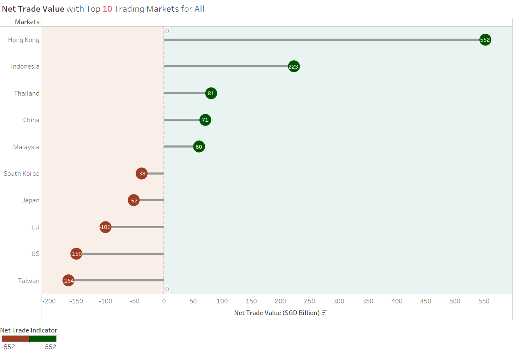
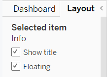
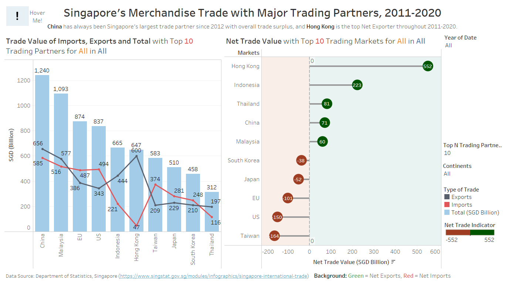

```{r setup, include=FALSE}
knitr::opts_chunk$set(echo = FALSE)
```

>This post was written as part of requirements for Visual Analytics course in MITB.

## 1. Introduction
For many countries, Singapore serves as an important port for trades and also heavily rely on imported goods for the country's usage. Trades primarily consist of imports and exports, where imports refer to goods brought into Singapore irrespective of the uses, while exports refer to goods brought out of the country. In order to understand the movement of goods in Singapore, data visualization is important to help us discover meaningful insights that could potentially drive better decision-making and improvement of Singapore's trades.

In this post, the original visualization chart of Singapore's Merchandise Trade from [_SingStat_](https://www.singstat.gov.sg/modules/infographics/singapore-international-trade) will be critically reviewed and an improved  alternate `interactive` design will be proposed.


## 2. Evaluation

The original chart is as shown below, where it consists of major trading regions (in picture shows top 10: China, Malaysia, United States, European Union, Taiwan, Korea, Japan, Indonesia, Thailand and Hong Kong) between a time period of January 2011 to December 2020.

<center>

{width=80%}

</center>

Before evaluating the chart, primary research on the visualization was conducted in order to understand what are the purposes of this graph as well as key takeaways for the readers.

* **Audience:** Government Agencies, policy-makers, businesses and individuals
* **Purpose:** To have a clear overview on which markets are the major net importers and exporters, as well as visualize the total trading volume with Singapore. The trade values used will be between a fixed time period of 2011 to 2020. The visualization will be made interactive for selected views.


### 2.1 Clarity

S/N | Critique | Approach
----| ---------|----------
1 |  |
2 |  |

### 2.2 Aesthetics

S/N | Critique | Approach
----| ---------|----------
1 |  |
2 |  |

## 3. Proposed Visualization Design


### 3.2 Advantages of New Design


## 4. Step-by-Step Methodology

### 4.1 Data Source

We will be using the same datasets of "import.csv" and "export.csv" as [DataViz Makeover #1](https://limjiahui.netlify.app/posts/2021-05-21-dataviz-makeover-1/). 


### 4.2 Data Preparation

As the raw dataset consists of multiple unwanted rows, columns and 'NA' values, we will be doing some pre-processing on **Tableau Desktop**. For the purpose of this interactive visualization, we will be using all trading markets in the dataset.


```{r table2, echo=FALSE, message=FALSE, results='asis', warnings=FALSE}
tabl <- "
| Steps | Description   | 
|-----|:-------------:|
| 1 | Import the raw dataset into Tableau Desktop. From there, we can see 2 different tables - T1 and T2.<br/>{width=50%}{width=50%}<br/>Click on _New Union_ and drag both T1 and T2 and select _Apply_. |
| 2 | The data table will be stacked and it should look something like this: <br/>{width=100%}<br/> Notice that the structure of the table is wrong, thus we can click on _Cleaned with Data Interpreter_ at the side pane and it will automatically detect the exact table structure.<br/>{width=50%}<br/>The data table should now look like this:<br/><br/> | 
| 3 | We will now filter the dates to January 2011 to December 2020. Shift and hold to select all unwanted columns, right click and select _Hide_. <br/>{width=60%}<br/> |
| 4 |  To convert the date columns to rows, we will use the _Pivot_ function by right clicking the selected columns. <br/>{width=70%}<br/> We can then rename the pivoted columns accordingly. |
| 5 |  Then, we shall rename the variables to shorter words for simiplicity and uniformity. Initially, the namings of the regions are very long and inconsistent as shown below.<br/>{width=80%}<br/> As there are many regions, it will take alot of time to rename all individually. Hence, we shall use the split function in Tableau. <br/>{width=80%}<br/> Great! Now tableau has automatically seperate the units and the region names. At the top right hand of the column, click on the tiny triangle and select _Aliases_. <br/>{width=60%}<br/> <br/>{width=90%}<br/> Now, we can check through the namings and rename those longer ones to their acronyms or shorter version. <br/>**Note:** There are few regions that requires some prior knowledge and research before renaming, eg. Commonwealth of Independent States (CIS) is a group of states together, and Democratic People's Republic of Korea is North Korea. <br/> The final names should look like this: <br/>{width=90%}<br/> We shall rename this new column as 'Markets'. |
| 7 | Also, we can rename the _Table Name_ to 'Type' and change the aliases from T1 and T2 to Exports and Imports accordingly.<br/>{width=80%}<br/> |
| 8 | After _split_ function above, notice that the 2nd variable columns becomes like this: <br/>{width=80%}<br/> Hence, we shall filter those out to tidy up our table. At the top right corner of the page, click on _Add_ under _Filter_. <br/>{width=70%}<br/> Select _Variables Split 2_ and check on the Million and Thousand only. <br/>{width=70%}<br/> After that, click on Ok to apply. |
| 9 |  Note that the SGD values recorded are not consistent, where some are in SGD Millon Dollars, while the rest are in SGD Thousands. As the numbers are all big, we will standardize across all values to SGD Billion Dollars. Create a _Calculated Field_ from the mini triangle again. <br/>{width=60%}<br/> We can enter the following formula to the field using if-else function and click _Apply_. <br/>{width=90%}<br/> |
| 10 |  Lastly, we shall change the Data type for the Date, from strings to Datetime format. <br/>{width=50%}<br/> |
"

cat(tabl) # output the table in a format good for HTML/PDF/docx conversion
```

Viola! Our data is well-prepped and ready to be used for visual constructions.


### 4.3 Data Visualization (1st Chart)

For this first chart, we will be examining the net exports and imports trade value based on each individual markets, using a horizontal diverging lollipop chart. 

#### Setting up the Plot

1. Open up a fresh empty worksheet, and drag _Markets_ into _Rows_ and _Filters_ pane. Because we want to compare between the markets individually, we will filter out the Total Exports and Imports, as well as the Continents (Europe, Asia, America, Oceania, Africa). The filters should look like below, and once all is selected properly, click on _Apply_.

<center>

{width=50%}

</center>

2. Next, we will create a calculated field to show the net trade values. Right-click onto the Data pane and click on _Create Calculated Field_. We will use an if-else function to multiply the SGD value to negative if it its imports (aka sheet = 'T1'). Hence, we can apply the formula as shown in Fig 4.3.3 and rename it to "Net Trade Indicator".


<center>

{width=50%}

{width=75%}

</center>


3. Now, drag the "Net Trade Indicator" into the _Columns_, and you can see a diverging bar chart already. In order to make it a lollipop shape, we have to use dual axis. Drag "Net Trade Indicator" again to columns to create this effect, but change the marks as "Circle" instead and thus it should look something like Fig 4.3.4. 

<center>


</center>


4. Now, lets join them together into one axis. Right click on the x-axis and select on _Dual Axis_. After that, remember to _Synchronize Axis_ so that the plots appear together in sync.


<center>

{width=30%}{width=30%}

{width=0%}

</center>


5. Note that after combining them, the shapes of the chart might be different. Do make sure that one of them is a circle, while the other is a bar graph. You can make the changes under the individual Marks pane (do not change the All marks pane!).

<center>

{width=30%}

</center>


6. Next, we shall alter the size and colour for the charts. For the lollipop shape, we need the bar graph to be very thin while the circle to be larger. We can make the necessary changes in its individual Marks pane as well, under _Size_ tab. We can also change the colours under _Color_ accordingly to make the stem and head more distinct. Once the changes has been made, we have achieved our lollipop shape!


<center>


{width=0%}

{width=70%}

</center>


7. As the original purpose of the graph is to see Singapore's **Major** trading partners, we shall now create a parameter called "Top N Trading Partners". This parameter can also be used as a filter to change the N value based on what the viewer wish to see.
    + Right click at the Data Pane and select _Create Parameter_.
    + We shall create a list with integers from 5-20 with stepsize of 5.
    + In order to allow it to work as a filter for _Markets_ variable, we can edit the _Markets_ filter by navigating to the _Top_ tab and select the _By field_, changing it to the name of the parameter we just created.
    + As we are interested in filtering by **Total Sum of Imports and Exports value**, we can select that condition under _by_ drop down menu as well.


<center>

{width=40%}{width=55%}

{width=0%}

{width=50%}{width=50%}

{width=0%}

</center>


8. Let us now tidy up our graphs but adding the directional colours, labels and filters. 
    + Firstly, we can change the colours based on the direction by dragging in "Net Trade Indicator" into the _Color_ tab for the **Circle** graph. Click on the colour legend and change it into two-step colours.
    + Then, we shall drag the "Net Trade Indicator" into the _Label_ tab for **Circle** graph and realign it to center.
    + As the numbers are quite long, we shall alter them into whole numbers for easier viewing. Right-click on the x-axis and select _Format_. Under the Default, we can customize the appearance of the numbers.
    + Lastly, we shall add our filters. Click on the parameter and select _Show Parameter_. We are also interested to see the changes across time, hence lets drag the _Date_ variable into the _Filters_ and display the years as a single value list.


<center>

{width=40%}{width=55%}

{width=0%}

{width=30%}{width=60%}

{width=0%}

{width=40%}{width=50%}

{width=0%}

</center>


9. To make our graph visibly clearer for readers, we shall add in a reference line as well as color-coded sections.
    + Right click onto the x-axis and select _Add Reference Line_.
    + Edit the parameters by changing the value to a constant 0, dotted line, as well as filled colours as shown in Fig 4.3.15.


<center>

{width=40%}

{width=60%}

</center>


#### Inserting Tooltip

Let's now make the visual more interactive with the use of tooltips. We can edit the tooltip manually or by adding calculated fields.

1. First, we can create a calculated field that will differentiate net importers and exporters. Right-click on the data pane and select _Create Calculated Field_. Then, we can input the formula as shown below, naming it as _Net Trade_Type_:

<center>

{width=70%}

</center>


2. Drag this field into the _Tooltip_ tab under Marks pane, and click on the tab. We shall edit the tooltip by clicking onto _Insert_ and select the various fields highlighted. We can also further beautify the tooltip with bolding, colours and changing of font size etc. Our final edit will look similar to Fig 4.3.16.

<center>

{width=70%}

{width=70%}

</center>


#### Final Graph

And now our first chart is done! After a few finishing touches (hiding the top axis, renaming chart title, sort in descending), our final static diverging lollipop graph will look like this:





### 4.4 Data Visualization (2nd Chart)

Moving on to the second chart, this graph will visualize the overall performance of each trading partners with Singapore via a bar and line chart combined together. We will also be using the same parameter filter and year filter for this chart.

#### Setting up the Plot

1. Create an empty sheet, and drag the _Markets_ into the _Columns_ panes. Similarly, we will filter the continents as well as total exports and imports out to focus on trading partners only. We can also add in the _Date_ into _Filters_ and also show the parameter as a filter as well, similar to the above chart.

2. Next, we shall generated two calculated fields, one for exports and the other for imports. We can simply divide them based on an if-else function for calculated fields as shown below.

<center>

{width=50%}{width=50%}

{width=0%}

</center>


3. From here, we shall drag the _Measures Values_ straight into the _Rows_ pane. Note that there will many values, and thus we will drag all out except for the Exports and Imports. We can then change the type of graph to a line chart, and it should like something below:

<center>

{width=100%}

</center>


4. Now, we shall add in the bar graph. Drag in _SGD (Billion)_ into the _Rows_ after the _Measure Values_. We can change the type of graph to bar chart, and also perform _Dual Axis_ and _Synchronize Axis_. 
    + Make sure to change the colours of the graph to make it more visible. Drag _Type_ into the _Color_ tab under the line graph Marks pane to get a distinguished colour for type of trade.
    + Additionally, sort the bar graph so that it appears in descending order. We can do so by clicking at the tiny icon beside the y-axis name of the bar chart.


<center>

{width=30%}{width=30%}

{width=0%}

</center>


5. In order to make our graph more interactive, we shall add in an additional filter (that will also be used with the above chart simultaneously) that allow the users to choose the continent. Each continent will also contain the respective countries and regions, which can be found [_HERE_](https://simple.wikipedia.org/wiki/List_of_countries_by_continents).
    + To do so, we will need to use the _Group_ function and manually group them accordingly.
    + With reference to the link, we can group all regions into 5 continents: Asia, Africa, Europe, America and Oceania. Those that does not fit will be pushed to "-" category which we won't be touching at all.
    + Eventually, we will want to achieve something like Fig. 4.4.4.Rename the column as _Continents_.
    
<center>

{width=30%}{width=50%}

{width=50%}

</center>


6. Next, we would want to add in this grouped data as a filter. Drag _Continents_ into the _Filters_. As we want to allow _Top N Trading Partners_ filter to be used together with the _Continents_ filter, click on the mini triangle of the _Continents_ filter and select _Add to Context_. Viola!! The top N partners shown will be based on the continents selected.


<center>

{width=40%}

</center>


#### Insert ToolTip

Similarly, we would want to let our tooltips give a brief summary of the graphs.

1. Click onto the tooltip for the bar chart and edit it to the style you wish for it to see. You can also edit the line chart accordingly. One sample of the final output is shown below:

<center>

{width=50%}{width=50%}

{width=0%}

</center>


#### Final Graph

Finally, we are done with the second chart! It is much easier as we have already generated the filters from previous chart. After some minor touch ups (renaming title, edit colours), the chart should look something like this:


### 4.5 Dashboard

Finally, lets compile all of our charts into the dashboard and make some final adjustments to the interactive portions.

1. Create an empty dashboard and drag in the "Trade Value" and "Net Trade Value" worksheets. For this dashboard, we will be using a fixed size of _Generic Desktop (1366 x 168)_ due to the volatility of the net trade value which will cause some compression if sizing is set to automated. We will also check the _Show Dashboard title_ and drag in _Blank_ or _Text_ objects to create spaces and captions.

<center>

{width=40%}{width=50%}

{width=00%}

</center>


2. After dragging the charts in and arrange them side-by-side, we would want to alter the filters to ensure that it applies to both charts together. Right click on each filter, go to _Apply to Worksheets_ and either choose _All Using This Data Source_ or select the worksheets on the dashboard.

<center>

{width=60%}

</center>


3. Next, let's do some **highlighting** to make the visual more interactive.
    + First, lets make sure that the legend can be highlighted so that the bar and line graph can be shown distinctly.
    + Next, we will create a _Highlight_ from _Actions_ using _Markets_ as selected fields for both "Trade Value" and "Net Trade Value".


<center>

{width=45%}


{width=40%}{width=40%}

{width=50%}

</center>


4. Notice that when we click onto the filters, the transitions are not very smooth? We can fix that by adding in _Animations_ from the _Format_ tab, followed by turning _On_ the workbook default.

<center>

{width=40%}{width=40%}


{width=0%}

</center>


5. Next, we will add in an info icon that will display useful information when hovered. This is not only an interactive feature, but also due to dashboard constraints, we can add in more information via the hover function.
    + Create an empty worksheet and rename it to "Info".
    + Create a calculated field and we will type in "Info". Apply the calculation.
    + Drag _Info_ into the _Rows_ pane. Right click on the sheet to hide away the title and header.
    + We will then change the Marks Pane to _Shape_, followed by clicking onto the _Shape_ tab to select the type of shape we want.
    + We can further format the sheet by removing the gridlines as well as changing the background colour by right-clicking select _Format_.
    + To make it hoverable with the correct information, we shall edit the _Tooltip_ accordingly.
    + Hence, the **final** text format for this icon should look something like in Fig 4.5.8.


<center>

{width=50%}{width=20%}{width=30%}

{width=0%}

{width=20%}{width=60%}

{width=0%}

{width=60%}

</center>


6. Next, we shall include a graphical illustration into the hover information. To do so, we need to create a new graph from a new worksheet.
    + Drag _Date_ and _Measure Values_ into the _Columns_ and _Rows_ pane respectively. 
    + Remove unwanted measured values so that only _Exports_, _Imports_ and _Total (SGD Billion)_ are left in the graph.
    + We shall annotate the graph, such that the lines are distinct. Drag the _Measure Names_ and _Measure Values_ into the _Label_ tab. We can also drag in _Measure Names_ to the _Color_ tab to allow colours to distinguish the different trade types.
    + As we notice fluctuations at 2016 and 2018, we shall add in reference lines at those points. First, we change the _Date_ type to continuous and then right-click on the axis to _Add Reference Line_.
    + Select the value to be a _Constant_ and the date to be at the beginning of the respective year (eg. 1/1/2016). We can display the label to be the constant value and format the line to dotted as well as thinner line.
    + The final overview should look something like Fig 4.5.13.

<center>

{width=60%}

{width=30%}

{width=30%}{width=30%}

{width=50%}

{width=80%}

</center>


7. After that, to include this graph into the tooltip, we shall go to the "Info" sheet's tooltip, select _Insert_, _Sheets_ and click onto the line graph.

<center>

{width=70%}

</center>


8. Finally, let's input this hover icon into the dashboard.
    + Drag in the "Info" sheet into the dashboard and change the format to _Floating_ so that we can position it to where we want.
    + Hide away the title of the sheet.
    + Let's also include a caption by dragging in the _Text_ object, making it floating as well and edit it accordingly.
    
<center>

{width=30%}{width=30%}

{width=0%}

</center>


Well done!! We are now set up for the visualization and ready to evaluate the observations we see! 


## 5. Final Visualization

The final visualization screenshot is as shown below, and the interactive version can be accessed [HERE](https://public.tableau.com/app/profile/lim.jiahui/viz/dataviz2_v2/FinalDashboard)




### Main Observations

1. **Top Trader**:
    + <p style="color:red">this part of which is red!</p>


---
<center>

That's all for my dataviz makeover #2 post! Thanks for reading :)

</center>


#### References

* [Statista](https://www.statista.com/chart/18356/net-importers-and-exporters/)
* [DataViz Peer Learning](https://isss608.netlify.app/dataviz/dataviz1#peer-learning)
* [Countries/Regions for each Continent](https://simple.wikipedia.org/wiki/List_of_countries_by_continents)


