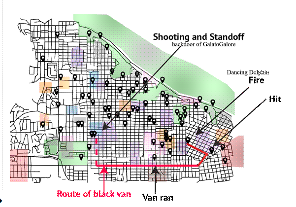
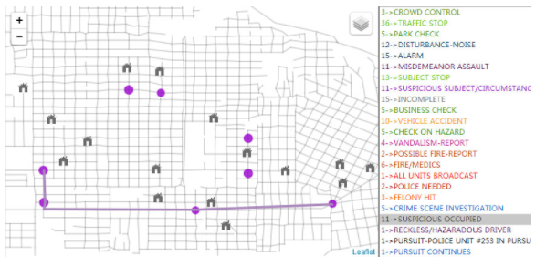

```{r setup, include=FALSE}
knitr::opts_chunk$set(echo = TRUE, 
                      warning = FALSE,
                      message = FALSE,
                      eval = TRUE,
                      fig.retina = 3,
                      fig.align = "center")
```

> This post was written as part of requirements for Visual Analytics course in MITB. The VAST Challenge 2021 scenario and all people, places, information are all fictitious.

## 1. Introduction and Objectives

In the island country of Kronos, a Tethys-based GAStech has been operating a natural gas production site on the island, producing remarkable profits and obtained strong relations with the Kronos government officials. However, GAStech's operations has affected the environmental stewardship. In January 2014, the leaders of GAStech were celebrating their new-found fortune when suddenly, in the midst of the celebration, several employees disappear. An organization known as Protectors of Kronos (POK) were suspected to be involved in the disappearance.

On the day of January 23 2014, there are also multiple events happening across Abila, a town in Kronos. Social media of the public as well as communication transcripts of the emergency departments in Abila were reocrded for analysis. As a analyst for this case, the aim of the challenge is to utilize text and visual analytics and evaluate the change of risk levels as well as recommend further actions for better emergency responses.


## 2. Literature Review

### 2.1 Past Mini-Challenge 3 Approaches

In VAST Challenge 2014, a similar setting and tasks were given out to participants and thus this serves as a learning platform for the 2021 challenge. Literature review is crucial to guide us in understanding the data provided, the background information and further formulate our analysis to discover meaningful insights via visualizations. 

Based on MC3 in 2014, the questions given were to derive the exact events occurring throughout the evening. The diagram below depicts overall findings of how the events unfold based on the microblog data (Figure 1) and the call centre messages (Figure 2).


<br/>




Overall, we can understand what are the major events that we can find from the data and this allow us to perform cross-referencing when doing the analysis later. In the data, mbdata are given together with longitude and latitude, while the ccdata is only given the street name. Using the shape file, we will be able to map the locations into geographical points and identify the both mb and cc locations.

Further literature review from the past challenges indicate several methods used in the analysis that includes wordcloud, network analysis and term frequency. However, there were also manual searching of the data which can be intensive. Hence, our approach will try to utilize graphical methods for analysis and reduce such manual activity.

Although the questions assigned for this year's challenge is slightly different, the main analysis and approach will be similar - to find the major events and timeline while understanding the risk level via sentiment analysis. From there, we can better evaluate when each event occurs and determine how the emergency dispatchers should be allocated and respond to such threats swiftly.


### 2.2 R Packages

The table below shows the R packages that will be used in this challenge.

| Package | Description |
|:-------|:-------------|
| tidyverse |   |
| dplyr |  |
| ggplot2 |   |
| plotly |   |
| lubridate |   |
| ggraph |   |
| igraph |   |
| DT |   |
| tm |   |
| wordcloud |   |
| tidytext |   |
| leaflet |   |


## 3. Exploratory Data Analysis and Data Wrangling

### 3.1 Setting up environment

| File | Description |
|:-------|:-------------|
| csv-1700-1830 | Covers the time period from 1700 to 1830 Abila time on January 23  |
| csv-1831-2000 | Covers the time period from 1830 to 2000 Abila time on January 23 |
| csv-2001-2131 | Covers the time period from 2000 to shortly after 2130 Abila time on January 23. |
| Geospatial Folder | Consisting of shapefiles for Abila and Kronos Island |

The data given in this challenge consists of three csv files, each spanning across different time period (1700-1830, 1831-2000, 2001-2131). In each file, the data includes mbdata (microblog) and ccdata (call centre), which then further elaborated with details such as datetime, message and location. Geospatial and Aspatial files were also included for location tracking.


The code chunk below dictates the installation or loading of packages.

```{r echo=TRUE}
packages = c('lubridate','tidyverse', 'ggplot2', 'ggraph', 'igraph', 
             'lsa', 'DT','tm', 'wordcloud', 'tidytext', 'dplyr',
             'textmineR', 'ggExtra', 'stringr','TSstudio',
             'hrbrthemes','plotly', 'ggridges','dygraphs','tokenizers',
             'data.table','leaflet','crosstalk','reshape2')

for (p in packages){
  if(!require(p, character.only = T)){
    install.packages(p)
  }
  library(p, character.only = T)
}
```


### 3.2 Data Extraction and Preparation

The table below shows an overall breakdown of the raw data format for both microblog messages (mbdata) and call center data (ccdata):

| Variables | mbdata format | ccdata format |
|:-------|:-------------|:-------------|
| date | In YYYYMMDDHHMMSS format. For example, July 8, 2014 at 11:59 pm would be 20140708235900 | In YYYYMMDDHHMMSS format. For example, July 8, 2014 at 11:59 pm would be 20140708235900 |
| author | Author name, a text string | - |
| message | The message string, containing up to 200 characters of content | Call center message type, containing up to 200 characters of content |
| latitude | Latitude from which the message was sent | - |
| longitude | Longitude from which the message was sent | - |
| location | - | The street or cross streets at which the incident took place |


We will then upload all the related file and combine it into one for easier processing. A glimpse of the combined data will be shown below.

```{r}
csv1 <- read_csv('data/csv-1700-1830.csv')
csv2 <- read_csv('data/csv-1831-2000.csv')
csv3 <- read_csv('data/csv-2001-2131.csv')

data <- rbind(csv1, csv2, csv3)
glimpse(data)
```

From here, we noticed that the date format of the raw data is not in a friendly format for data wrangling. Hence, we will utilize the _lubridate_ package functions to convert the format into POSIXct datetime. The time will also be extracted out for ease of analysis in later parts.


```{r}
data$datetime <- ymd_hms(data$`date(yyyyMMddHHmmss)`)
data$time <- format(as.POSIXct(data$datetime), format = "%H:%M:%S")
glimpse(data$datetime)
```

To ensure that the data can be used for manipulation, we will first check for any missing or NULL values in the respective columns. 

```{r}
indx <- apply(data, 2, function(x) any(is.na(x) | is.infinite(x)))
indx
```

As the columns with NULL values are reasonable, we will thus proceed with the data processing and analysis.


### 3.3 Pre-processing Analysis

To get some understanding of the data, we will first seperate the call centre data and the microblog data. Then, we will create a function to categorize the datetime into timebins for easier analysis in both datasets. The timebins chosen are within 30 minutes interval.


```{r echo=FALSE}
# separating cc and mb data
cc <- data %>% filter(type=="ccdata")
mb <- data %>% filter(type=="mbdata")


timeintervals <- function(df) {
  df$timebin <- "-"
  df[df$time < "17:30:00", "timebin"] <- "5-5:30pm"
  df[df$time >= "17:30:00" & df$time < "18:00:00", "timebin"] <- "5:30pm-6pm"
  df[df$time >= "18:00:00" & df$time < "18:30:00", "timebin"] <- "6-6:30pm"
  df[df$time >= "18:30:00" & df$time < "19:00:00", "timebin"] <- "6:30pm-7pm"
  df[df$time >= "19:00:00" & df$time < "19:30:00", "timebin"] <- "7-7:30pm"
  df[df$time >= "19:30:00" & df$time < "20:00:00", "timebin"] <- "7:30pm-8pm"
  df[df$time >= "20:00:00" & df$time < "20:30:00", "timebin"] <- "8-8:30pm"
  df[df$time >= "20:30:00" & df$time < "21:00:00", "timebin"] <- "8:30pm-9pm"
  df[df$time >= "21:00:00", "timebin"] <- "9-9:31pm"
  return(df)
}


# creating time bin for analysis
cc <- timeintervals(cc)

# getting call frequency from 1700-2131
freq <- cc %>% group_by(timebin) %>%
  summarize(num = n())
#par(mar=c(5,6,4,1)+.1)
# Uniform color
bar1 <- barplot(height=freq$num, names=freq$timebin, col=c(rgb(0.3,0.1,0.4,0.6) , rgb(0.3,0.5,0.4,0.6)),
                main="Call Frequencies per Time Interval", ylim=c(0,50))
# Add the text 
text(bar1, freq$num, paste("Freq: ", freq$num, sep=""), cex=1, pos=3)


```


Based on each timebins, we will first plot the call frequencies received by the call centre. The counts are plotted into a bar graph as shown above, and we observe that the highest number of calls received is from 7:30pm to 8pm. Hence, this suggests that there might be some incident happening.


Next, we will proceed to further break down the type of calls received within each timebin.

```{r fig.align="center", echo = FALSE, fig.width=10, fig.height=10}
# type of calls
types <- unique(cc$message)
count_type <- cc %>% group_by(message, timebin) %>% 
  summarize(count = n()) 
# setting margin
#par(mar = c(5, 5, 5, 5)) 
ggplot(count_type, aes(x = count, y = message, fill = timebin,
                       stringr::str_wrap(count_type$message, 15))) +
  geom_bar(position="stack",stat="identity") +
  scale_fill_viridis(discrete = T,option = "H") +
  theme_ipsum() +
  ggtitle("Calls per Time Bin") +
  theme(axis.text.x = element_text(face="bold", color="#000092",
                                   size=8, angle=0),
        axis.text.y = element_text(face="bold", color="#000092",
                                   size=8, angle=0))
```

The graph is plotted by total counts of calls for each call type, and also further segmented based on the different time bins as shown in the legend. We observe that the most common call is for "Traffic Stop", with its highest frequency noted from 6-6:30pm.Interestingly, we noticed that from 7:30pm-8pm, the most number of calls are related to a "Suspicious occupied vehicle - black van". From here, we can deduce that there is a pursuit ongoing within the timeframe.


Besides call center data, we will now explore the microblog data. The messages were grouped by each timestamp and counted by the frequency of microblogs. The plot below shows the frequency of messages posted throughout the entire timeline. As the plot is interactive, we can drag across the timeline and hover to see the counts. Based on the graph, it was observed that the most active period falls from 6:45pm to 8:35pm, whereby the frequency of microblogs are the highest with lots of fluctuations.


```{r echo = FALSE}
mb_per_time <- mb %>% 
  group_by(as.POSIXct(datetime, format = "%H:%M:%S")) %>% 
  summarize(no_microblogs = n())
ts_plot(mb_per_time,
        title = "Microblog Frequency Per Time",
        Xtitle = "Time",
        Ytitle = "Frequency",
        line.mode = "lines+markers",
        slider = TRUE,
        Ygrid = TRUE)
```


### 3.4 Text Pre-processing and Exploratory Analysis

Using the _tm_ package, the microblog messages will now be broken down using text mining techniques in the following order:

1. Creating a corpus by combining all messages as documents
2. Converting all text to lowercase for easier referencing
3. Remove punctuation, symbols and numbers
4. Tokenize each words (seperate them from sentences)
5. Removing stopwords (words that are common such as pronouns and prepositions)
6. Converting texts to its root form via stemming (eg. from "ran" to "run")

With the words broken down, we will be able to study the relationship(s), meaning and count the individual frequency.

#### Considering all words

We will first combine all words together (regardless of retweets, mentions etc) to get an overall understanding of the most frequently occurred word(s).

```{r echo = FALSE}
# Build a corpus containing all the microblogs
corpus <- VCorpus(VectorSource(mb$message))
# convert the text to lowercase
corpus <- tm_map(corpus, content_transformer(tolower))
corpus<-tm_map(corpus, PlainTextDocument)
# creating own punctuation removal instead of using from tm as they do not insert blank spaces
replacePunctuation <- content_transformer(function(x) {return (gsub("[[:punct:]]"," ", x))})
# remove all punctuation from the corpus
corpus<-tm_map(corpus, replacePunctuation)
# remove all numbers
corpus<-tm_map(corpus, removeNumbers)
# remove all English stopwords from the corpus
corpus<-tm_map(corpus, removeWords, stopwords("en"))
# stemming the words to its root form in the corpus
corpus<-tm_map(corpus, stemDocument)
# term matrix and get the frequency counts of each word
term_doc_mat <- TermDocumentMatrix(corpus)
tokens <- as.matrix(term_doc_mat)
f <- sort(rowSums(tokens),decreasing=TRUE)
d <- data.frame(word = names(f),freq=f)

# showing top 200 words
set.seed(1234)
wordcloud(words = d$word, freq = d$freq, min.freq = 1,
          max.words=200, random.order=FALSE, rot.per=0.35, 
          colors=brewer.pal(8, "Dark2"))
```

The frequencies of each word are plotted using _wordcloud_, and we observe that the most commonly posted words (the bigger the size, the higher the count) are "pokral", "kronosstar" and "abila".


#### Top trending Hashtags, Retweets and Mentions

Separately, we wish to understand the trending topics or events occurring during the evening. This can be tracked via hashtags (words with "#" in front). Hence, we will use regular expresssion techniques (regex) to sieve out the hashtags and count the frequency.

```{r echo = FALSE}

mb$hashtags <- "-"
for (i in 1:nrow(mb)){
  mb$hashtags[i] <- str_extract_all(mb$message[i], "#\\S+")
}
# Build a corpus containing all hashtags
HT.corpus <- VCorpus(VectorSource(mb$hashtags))
# convert the text to lowercase
HT.corpus <- tm_map(HT.corpus, content_transformer(tolower))
HT.corpus<-tm_map(HT.corpus, PlainTextDocument)
# term matrix and get the frequency counts of each hashtag
HT.tdm <- TermDocumentMatrix(HT.corpus)
HT <- as.matrix(HT.tdm)
HT.f <- sort(rowSums(HT),decreasing=TRUE)
HT.d <- data.frame(word = names(HT.f),freq=HT.f)


set.seed(1234)
wordcloud(words = HT.d$word, freq = HT.d$freq, min.freq = 1,
          max.words=200, random.order=FALSE, rot.per=0.35, 
          colors=brewer.pal(8, "Dark2"))

```

Based on the wordcloud, we observe that the top trending hashtag is "#pokrally", and this suggests that there are many messages related to the rally happening that evening.


#### Top Mentions or Retweets

Besides hashtags, we can also explore the number of mentions or retweets by different authors. 


```{r echo = FALSE}
mb$mentions <- "-"
for (i in 1:nrow(mb)){
  mb$mentions[i] <- str_extract_all(mb$message[i], "@\\S+")
}
# Build a corpus containing all hashtags
MEN.corpus <- VCorpus(VectorSource(mb$mentions))
# convert the text to lowercase
MEN.corpus <- tm_map(MEN.corpus, content_transformer(tolower))
MEN.corpus<-tm_map(MEN.corpus, PlainTextDocument)
# term matrix and get the frequency counts of each hashtag
MEN.tdm <- TermDocumentMatrix(MEN.corpus)
MEN <- as.matrix(MEN.tdm)
MEN.f <- sort(rowSums(MEN),decreasing=TRUE)
MEN.d <- data.frame(word = names(MEN.f),freq=MEN.f)

set.seed(1234)
wordcloud(words = MEN.d$word, freq = MEN.d$freq, min.freq = 1,
          max.words=200, random.order=FALSE, rot.per=0.35, 
          colors=brewer.pal(8, "Dark2"))
```

From the wordcloud, the most frequently mentioned or retweeted messages are related to "@abilapost" and "@kronosstar". This suggests that these authors belong to official organizations or media outlets.


#### Showing words without hashtags and mentions

After analyzing all the different type of messages, we will now evaluate the raw text - that is by removing all hashtags, mentions and retweets. Similarly, the text will also undergo text mining techniques to retrieve the root tokenized form. This will allow us to understand the topics of messages trending by counting frequency of these words.

```{r echo = FALSE}
mb$words.only <- "-"
# remove retweets too (akaa "RT @____")
for (i in 1:nrow(mb)){
  mb$words.only[i] <- sub("(?:\\s*#\\w+)+\\s*$", " ", mb$message[i]) #hashtags
  mb$words.only[i] <- gsub("(RT|via)((?:\\b\\W*@\\w+)+)", " ", mb$words.only[i])  #retweets
  mb$words.only[i] <- gsub("@\\S+", " ", mb$words.only[i])   #normal mention
}
# Build a corpus containing all the words
corpus_words <- VCorpus(VectorSource(mb$words.only))
# convert the text to lowercase
corpus_words <- tm_map(corpus_words, content_transformer(tolower))
corpus_words<-tm_map(corpus_words, PlainTextDocument)
# creating own punctuation removal instead of using from tm as they do not insert blank spaces
replacePunctuation <- content_transformer(function(x) {return (gsub("[[:punct:]]"," ", x))})
# remove all punctuation from the corpus
corpus_words<-tm_map(corpus_words, replacePunctuation)
corpus_words<-tm_map(corpus_words, removeNumbers)
# remove all English stopwords from the corpus
corpus_words<-tm_map(corpus_words, removeWords, stopwords("en"))
# stemming the words to its root form in the corpus
corpus_words<-tm_map(corpus_words, stemDocument)
# term matrix and get the frequency counts of each word
tdm_words <- TermDocumentMatrix(corpus_words)
w <- as.matrix(tdm_words)
w.f <- sort(rowSums(w),decreasing=TRUE)
w.d <- data.frame(word = names(w.f),freq=w.f)

# wordcloud
set.seed(1234)
wordcloud(words = w.d$word, freq = w.d$freq, min.freq = 1,
          max.words=200, random.order=FALSE, rot.per=0.35, 
          colors=brewer.pal(8, "Dark2"))
```

From the wordcloud, we noticed that the most commonly appeared word is "fire". This suggests that there might be a fire-related accident occurring during the evening. 


## 4. Unsupervised Text Classification (Q1)

>Using visual analytics, characterize the different types of content in the dataset. What distinguishes meaningful event reports from typical chatter from junk or spam? Please limit your answer to 8 images and 500 words.

### Brief overview of events by Hashtags

From above analysis, we noticed that hashtags can give some initial ideas of the content or events happening. Hence, we will be using the hashtags frequencies and plot against time to observe how the top hashtags changes throughout the whole evening.

```{r echo=FALSE}
# getting timebins
mb <- timeintervals(mb)

HT_df <- mb[, c("datetime", "time", "timebin", "message", "hashtags")]
HT_df <- unnest(HT_df)
# removing symbols and converting to lowercase
HT_df$hashtags <- lapply(HT_df$hashtags, tolower)
HT_df$hashtags <- str_replace_all(HT_df$hashtags, "[[:punct:]]", "")

HT_per_time <- HT_df %>%
  group_by(timebin, hashtags) %>%
  summarize(HT_count = n()) %>%
  ungroup()

# creating matrix
library(reshape2)
matrix <- acast(HT_per_time, hashtags~timebin, value.var='HT_count', fill=0)

comparison.cloud(matrix, max.words = 500, 
                 random.order = FALSE, 
                 c(4,0.5), 
                 title.size = 1.2,
                 colors = brewer.pal(9, "Dark2") )

```

As we plot a static wordcloud based on the timebins, the top trending hashtag changes across time. The main observations can be broken down below:

- **6-6:30pm:** The most posted hashtag throughout whole evening is "pokrally", and it is shown to occur within the time frame of 6-6:30pm. Hence, this gives a rough idea of the starting time or period of the rally occurring that evening.

- **7:30pm-8pm:** There seems to be a shooting happening during this time period, as shown by the hashtags with top hashtag word of the time period to be "shooting".

- **9-9:31pm:** The shooting seems to have intensified during this period, as one of the top hashtags apears to be "standoff" and "apd" (apd seems to stand for Abila Police Department).


The changes in hashtags can be further explored and validated using the interactive plot below, where we see the extact time the hashtags appear throughout the evening.


```{r echo=FALSE, fig.width=8}

HT_per_time2 <- HT_df %>%
  group_by(time, hashtags) %>%
  summarize(HT_count = n()) %>%
  ungroup()

plot_ly(data = HT_per_time2, 
        x = ~time, y = ~HT_count,
        type = 'scatter',
        marker = list(size = 8),
        text = ~paste("Hashtag:", hashtags,
                      "<br>Count:", HT_count),
        color = ~hashtags)

```

As we click onto the hashtag = "standoffover", we see that this hashtag appeared from 21:18:47 to "21:27:12". We can now understand the beginning and ending of this entire shooting event.

Additionally, we observe that "pokrally" hashtag trended throughout the evening regardless if the event ended.


### Removing Spam messages

After having a rough idea of the major events happening, we will now proceed to identify the important messages by classifying the junk and spam. Spam messages means that the same message type is repeated many times, and this can be determined by calculating the spam index of EACH author, with the formula given below:

$$
spam index = \frac{number of distinct messages}{total number of messages}
$$

As such, the lower the spam index, the more likely it is a spam.

```{r echo=FALSE}
author_spam <- mb %>% 
  group_by(author) %>% 
  summarize(no_messages = n(), distinct_msg = n_distinct(message)) %>% 
  mutate(spam_index = distinct_msg/no_messages) %>%
  arrange(spam_index)

# giving authors a number
author_spam$id <- 1:nrow(author_spam)
#showing table
DT::datatable(author_spam, filter = 'top') %>%
  formatStyle(0,
              target = 'row')

## add extra space to right margin of plot within frame
par(mar=c(5, 6, 4, 6) + 0.2)
## Plot first set of data and draw its axis
plot(author_spam$id, author_spam$no_messages, pch=16, 
     axes=FALSE, ylim=c(0,1500), xlab="", ylab="", 
     type="b",col="black", main="Spam Detection by Author")
axis(2, ylim=c(0,1),col="black",las=1)  ## las=1 makes horizontal labels
mtext("No. of messages",side=2,line=4)
box()

## Allow a second plot on the same graph
par(new=TRUE)
## Plot the second plot and put axis scale on right
plot(author_spam$id, author_spam$spam_index, 
     pch=15,  xlab="", ylab="", ylim=c(0,1), 
     axes=FALSE, type="b", col="red")
## a little farther out (line=4) to make room for labels
mtext("Spam Index",side=4,col="red",line=3) 
axis(4, ylim=c(0,7000), col="red",col.axis="red",las=1)
## Draw the time axis
axis(1,pretty(range(author_spam$id),10))
mtext("Author's ID",side=1,col="black",line=2.5)  

```

The interactive table shows a column of the spam index per author, as well as the raw counts and distinct author ID. The rows of the table are arranged in ascending order of spam index. The graph is then plotted to show the various message counts as well as the spam index.

As the spam index for "KronosQuoth" and "Clevvah4Evah" is very low despite the large number of messages sent during the entire time-period, they are classified as spam accounts (sending messages of same type every interval). Hence, messages from these 2 authors will be removed.


### Removing Junk messages

Junk messages are classified as messages that do not hold importance or irrelevant context. This can be identified by measuring the tf-idf (term frequency - inverse document frequency) of each word. The rarer the word occur in the entire corpus, the higher the tf-idf value, and hence showing the words of "least importance".

To proceed in creating the corpus, we will first remove messages from the 2 authors identified as spam earlier. As hashtags proved to give certain importance in identifying events, we will include them into the corpus (while removing retweets and mentions). The code below shows the relevant data wrangling of messages.


```{r echo=FALSE}

# removal of the 2 authors
mb2 <- mb[mb$author!="KronosQuoth" & mb$author!="Clevvah4Evah", ]
# ======== preparing corpus to be used ========
# note: we will include hashtags in as they may indicate certain events
mb2$words.with.HT <- "-"
  
# remove retweets too (akaa "RT @____")
for (i in 1:nrow(mb2)){
  # retweets
  mb2$words.with.HT[i] <- gsub("(RT|via|rt)((?:\\b\\W*@\\w+)+)", " ", mb2$message[i])
  # mentions
  mb2$words.with.HT[i] <- gsub("@\\S+", " ", mb2$words.with.HT[i])
}

```


Using the _tidytext_ package, we will create a _tibble_ and perform _dplyr_ operations to process and prepare the new corpus into tokenize words. The tf-idf will then be calculated using the *bind_tf_idf* function.


```{r echo=FALSE}

# ========= tidytext ========
text_df2 <- tibble(line = 1:nrow(mb2), text = mb2$words.with.HT)
# tokenizations and removal of stopwords, numbers and patterns
text_df2 <- text_df2 %>% 
  mutate(text_df2, text = gsub(x = text, pattern = "[0-9]+|[[:punct:]]|\\(.*\\)", 
                              replacement = " ")) %>% 
  unnest_tokens(word,text) %>%
  filter(str_detect(word, "[a-z']$"),
         !word %in% stop_words$word) 

  
text_df2 <- text_df2 %>%
  group_by(line) %>%
  count(word, sort = TRUE) %>%
  ungroup()

tfidf <- text_df2 %>%
  bind_tf_idf(word, line, n) %>%
  arrange(desc(tf_idf))

# === tfidf boxplot ===
tfidf_1 <- tfidf %>%
  ggplot( aes(y=tf_idf)) +
    geom_boxplot() +
    geom_hline(yintercept = 4, linetype = "dashed", color = "red") +
    ggtitle("TF-IDF") +
    xlab("")

# === tfidf cluster ===
tfidf.cluster <- tfidf[, c('word','tf_idf')]
set.seed(1234)
tfidf_2 <- tfidf.cluster %>%
  filter(tf_idf >= 4) %>%
        graph_from_data_frame() %>%
        ggraph(layout = "fr") +
        geom_node_point(color = "darkslategray4", size = 3) +
        geom_node_text(aes(label = name), vjust = 1.8, size = 3) +
        labs(title = "TF-IDF Cluster: Junk Detection",
             subtitle = "Microblog Messages ",
             x = "", y = "")

library(gridExtra)
grid.arrange(tfidf_1, tfidf_2,
             ncol=2, nrow=1,
             widths=c(1.5,4))

```


As we get the tf-idf values, we will plot them into a boxplot to look at the spread of the values. Note that the spread becomes lesser after tf-idf = 4 (indicated by the red dash line), hence we will plot out the words with tfidf >= 4 and observe the clusters formed. 

The nodes are plotted according to their tf-idf value, with the center node labeled as the value each surrounding word has. From here, we observe that words with lesser importance are generally clustered with tf-idf >= 6. To better evaluate the messages with these words, the table below is generated.


```{r echo = FALSE}
junk <- tfidf %>% filter(tf_idf >= 6)
junk$message <- "-"
for (i in 1:nrow(junk)){
  junk$message[i] <- mb2$message[junk$line[i]]
}
DT::datatable(junk, filter = 'top') %>%
  formatRound(columns = c('tf','idf','tf_idf'),
              digits = 3) %>%
  formatStyle(0,
              target = 'row')
```

The higher the tf-idf, the more rare the term is and may not hold importance. Based on prior knowledge of the major events by hashtags analysis, we can identify some junk messages - those that does not add value to the content. Hence, we can eliminate lines 189, 600, 1252, 1266, 1496, 1580 and 2440.


```{r echo=FALSE}
l_remove <- c(189, 600, 1252, 1266, 1496, 1580, 2440)
# remove rows by putting minus sign (-) in front)
mb3 <- mb2[-l_remove,]
# ===== updated corpus =====
text_df3 <- tibble(line = 1:nrow(mb3), text = mb3$words.with.HT)
# tokenizations and removal of stopwords, numbers and patterns
text_df3 <- text_df3 %>% 
  mutate(text_df3, text = gsub(x = text, pattern = "[0-9]+|[[:punct:]]|\\(.*\\)", 
                              replacement = " ")) %>% 
  unnest_tokens(word,text) %>%
  filter(str_detect(word, "[a-z']$"),
         !word %in% stop_words$word) 
  
```


## 5. Topic Modeling and Sentiment Analysis (Q1, Q2)

> Use visual analytics to represent and evaluate how the level of the risk to the public evolves over the course of the evening. Consider the potential consequences of the situation and the number of people who could be affected. Please limit your answer to 10 images and 1000 words.


### Topic Modeling by Cosine Similarity and Walktrap Algorithm

To further evaluate the messages and obtain words that forms a certain topic, we will conduct Topic Modeling by calculating the Cosine Similarity of each words, as it is a fair measure since it disregard the size of the document. The words are considered similar if they are frequently occurred together within the same message. Hence, the closer the word vectors, the nearer the cosine similarity value is to 1.

Topic modeling has various techniques, and one of the most commonly used method is the Latent Dirichlet Allocation (LDA). However, as we are using Cosine similarity as a measure, we will be using Latent Semantic Analysis (LSA) instead. A final term matrix with similarity values will be generated, and they are evaluated by plotting a network graph. An algorithm known as the Walktrap Algorithm is introduced, as it is a community detection algorithm for clusters within the network graph. This means that it is able to automatically generate clusters of nodes by random walks of T steps. These clusters will then form a topic each.


As the corpus is relatively large, we will focus on visualizing top 80 percentile of similarity values among the words.

```{r echo = FALSE}
cosine_matrix <- function(tokenized_data, lower = 0, upper = 1, filt = 0) {
  
  if (!all(c("word", "line") %in% names(tokenized_data))) {
    stop("tokenized_data must contain variables named word and id")
  }
  
  if (lower < 0 | lower > 1 | upper < 0 | upper > 1 | filt < 0 | filt > 1) {
    stop("lower, upper, and filt must be 0 <= x <= 1")
  } 
  
  docs <- length(unique(tokenized_data$line))
  
  out <- tokenized_data %>%
    count(line, word) %>%
    group_by(word) %>%
    mutate(n_docs = n()) %>%
    ungroup() %>%
    filter(n_docs < (docs * upper) & n_docs > (docs * lower)) %>%
    select(-n_docs) %>%
    mutate(n = 1) %>%
    spread(word, n, fill = 0) %>%
    select(-line) %>%
    as.matrix() %>%
    lsa::cosine()
  
  filt <- quantile(out[lower.tri(out)], filt)
  out[out < filt] <- diag(out) <- 0
  out <- out[rowSums(out) != 0, colSums(out) != 0]
  
  return(out)
}
cos_mat <- cosine_matrix(text_df3, lower = .01, upper = .80, filt = .80)
# graph
g <- graph_from_adjacency_matrix(cos_mat, mode = "undirected", weighted = TRUE)

walktrap_topics <- function(g, ...) {
  wt <- igraph::cluster_walktrap(g, ...)
  
  membership <- igraph::cluster_walktrap(g, ...) %>% 
      igraph::membership() %>% 
      as.matrix() %>% 
      as.data.frame() %>% 
      rownames_to_column("word") %>% 
      arrange(V1) %>% 
      rename(group = V1)
  
  dendrogram <- stats::as.dendrogram(wt)
  
  return(list(membership = membership, dendrogram = dendrogram))
}
topics <- walktrap_topics(g)
topics$membership %>% 
  group_by(group) %>% 
  summarise(words = paste(word, collapse = ", "))
```

```{r echo = FALSE}
V(g)$cluster <- arrange(topics$membership, word)$group
set.seed(1234)
ggraph(g, layout = "nicely") +
  geom_edge_link(aes(alpha = weight, 
                     width = weight), 
                 show.legend = TRUE) + 
  geom_node_label(
    aes(label = name, color = factor(cluster)), 
    show.legend = TRUE
  ) +
  theme_void()
```

In the code chunks above, the pre-processed text goes through the algorithm to generate the similarity matrix and the final output generated is shown in the graph above. A total of 8 topics are generated and we are able to observe the words belonging to these topics (colour-coded). The similarity values are also plotted via the weights of the edges.

The overall topics of the microblogs generated are:

- **Topic 1:** Shooting standoff at a gelato place
- **Topic 2:** Influential figurehead or speakers
- **Topic 3:** 2 incidents - Fire at Dancing Dolphin building and a possible hit-and-run
- **Topic 4:** About Kronos
- **Topic 5:** Details of the incident(s)
- **Topic 6:** POK rally
- **Topic 7:** An incident regarding to a van and cops 
- **Topic 8:** Casualties or seriousness in the incidents

Overall, there are a total of 4 major events occurred during that evening; a fire at dancing dolphin, a hit-and-run accident, a rally and a shooting standoff.

We will now find the messages containing these words in order to better understand the timeline and context of the topics generated, which will also prepare for further analysis later.


```{r echo=FALSE}

topic_words <- unique(topics$membership$word)
groupings <- topics$membership
topics_df <- data.frame(matrix(ncol=0, nrow=nrow(text_df3)))
topics_df$line <- "-"
topics_df$word <- "-"
topics_df$message <- "-"
topics_df$time <- "-"
topics_df$group <- "-"
topics_df$author <- "-"
topics_df$longitude <- "-"
topics_df$latitude <- "-"

library(lubridate)
for (i in 1:nrow(text_df3)){
  if (text_df3$word[i] %in% topic_words){
    no <- text_df3$line[i]
    topics_df$line[i] <- no
    topics_df$message[i] <- mb3$message[no]
    topics_df$time[i] <- mb3$time[no]
    topics_df$group[i] <- groupings$group[which(groupings$word==(text_df3$word[i]))]
    topics_df$word[i] <- text_df3$word[i]
    topics_df$author[i] <- mb3$author[no]
    topics_df$longitude[i] <- mb3$longitude[no]
    topics_df$latitude[i] <- mb3$latitude[no]
  }
}

topics_df <- topics_df %>%
  filter_all(any_vars(!. %in% c("-"))) %>%
  mutate(date = ymd("2014-01-23")) %>%
  mutate(datetime = ymd_hms(paste(date, time)))

```


### Sentiment Analysis (Risk Level)

Now that we know the major events happened, we can better evaluate the risk levels via sentiment analyis of the words. Sentiment lexicons can be found using the _nrc_ package, where it consists of a dictionary of words that has similar meanings to certain emotions. Hence, we are able to match the tokenized words with these lexicons and get a better understanding of the underlying sentiment with each topics.

```{r echo=FALSE}
# tokenizations and removal of stopwords, numbers and patterns
text_df4 <- mb3 %>% 
  select(datetime, time, author, words.with.HT) %>%
  mutate(line = 1:nrow(mb3))

text_df4 <- text_df4 %>% 
  mutate(text_df4, text = gsub(x = words.with.HT, 
                               pattern = "[0-9]+|[[:punct:]]|\\(.*\\)", 
                               replacement = " ")) %>% 
  unnest_tokens(word,text) %>%
  filter(str_detect(word, "[a-z']$"),
         !word %in% stop_words$word) 

# getting sentiment lexicons from "nrc" --> it contains emotions
nrc_words <- text_df4 %>%
  inner_join(get_sentiments("nrc"), by = "word")

count_sentiment <- nrc_words %>% 
  group_by(sentiment) %>%
  summarize(n = n()) %>%
  arrange(desc(n)) %>%
  ggplot(aes(x = sentiment, y = n)) +
  geom_segment(aes(x = sentiment, xend = sentiment,
                   y = 0, yend = n),
               color="skyblue") +
  geom_point(color="blue", size=4, alpha=0.6) +
  theme_light() +
  coord_flip() +
  theme(
    panel.grid.major.y = element_blank(),
    panel.border = element_blank(),
    axis.ticks.y = element_blank()
  )

count_sentiment
```


A quick analysis of the sentiments detected can be done by counting the frequencies, and we noticed that "Fear" and "positive" emotions were generated the most. The sentiment levels will be further evaluated across the whole time period in the later part of the post, where we can better understand the changes in risk levels.


### Time-series Analysis of Topics and Sentiment

As we have identified the 4 main events happening during the time period, we will focus on analysing the words and hashtags that describes these events.

Key Words generated by network graph above:

| Event | Top Correlated Words |
|:-------|:-------------|
| POK Rally | abilapost, city, park, peaceful, pok, presence, rally, audrey, di, dr, jakab, lucio, marek, newman, pokrally, stefano, sylvia, viktor |
| Shooting at a gelato place | black, cops, guy, guys, im, tag, van, abila, alexandrias, ambulance, apd, businesses, centralbulletin, continues, cop, crowd, evacuating, fired, galore, gelato, gelatogalore, gun, hostage, hostages, intnews, ithakis, kronosstar, lot, officier, people, police, public, report, scene, shooting, shot, shots, stand, standoff, stay, surrounding, swat, terrorists, time |
| Fire at Dancing Dolphin | floor, newsonline, resident, top, trapped, word, achilleos, additional, afd, afdheroes, apartment, arrived, building, buildings, coming, control, dancing, dancingdolphinfire, department, dispatched, dolphin, evacuate, evacuated, evacuation, fire, inside, madeg, officials, reports, residents, run, site, trucks, units |
| Hit-and-run accident | hit, run, van |


#### TF-IDF vs Time

Previously, we understood that TF-IDF determines how important a word is. Hence, we will further analyse how the most important words (lowest TF-IDF) changes within each time intervals.

Firstly, we generate a list of words pertaining to the 4 major events.

```{r echo=FALSE}
# words for each topic
rally <- c("abilapost", "city", "park", "peaceful", "pok", "presence", "rally", "audrey", "di", "dr", "jakab", "lucio", "marek", "newman", "pokrally", "stefano", "sylvia", "viktor")
shooting <- c("black", "cops", "guy", "guys", "im", "tag", "van", "abila", "alexandrias", "ambulance", "apd", "businesses", "centralbulletin", "continues", "cop", "crowd", "evacuating", "fired", "galore", "gelato", "gelatogalore", "gun", "hostage", "hostages", "intnews", "ithakis", "kronosstar", "lot", "officier", "people", "police", "public", "report", "scene", "shooting", "shot", "shots", "stand", "standoff", "stay", "surrounding", "swat", "terrorists", "time")
fire <- c("floor", "newsonline", "resident", "top", "trapped", "word", "achilleos", "additional", "afd", "afdheroes", "apartment", "arrived", "building", "buildings", "coming", "control", "dancing", "dancingdolphinfire", "department", "dispatched", "dolphin", "evacuate", "evacuated", "evacuation", "fire", "inside", "madeg", "officials", "reports", "residents", "run", "site", "trucks", "units")
hitrun <- c("hit", "run", "van")
```

Using this generated list, we will then proceed to sieve out relevant messages and measure their TF-IDF.

```{r echo=FALSE, fig.height=6, fig.width=9}
tfidf2 <- text_df4 %>%
  select(time, line, word) %>%
  count(time,line, word, sort = TRUE) %>%
  bind_tf_idf(word, line, n) %>%
  arrange(desc(tf_idf))

#finding relevant rows and label
tfidf2$Event <- "Others"
tfidf2[tfidf2$word %in% rally,"Event"] <- "Rally"
tfidf2[tfidf2$word %in% shooting, "Event"] <- "Shooting"
tfidf2[tfidf2$word %in% fire, "Event"] <- "Fire"
tfidf2[tfidf2$word %in% hitrun, "Event"] <- "Hit&Run"

# getting time bin
tfidf2 <- timeintervals(tfidf2)

tfidf2 %>%
  group_by(timebin, word, Event) %>%
  summarize(mean_tfidf = mean(tf_idf)) %>%
  ungroup() %>%
  group_by(timebin) %>%
  arrange(mean_tfidf) %>%
  slice_min(mean_tfidf, n = 10, with_ties = FALSE) %>%
  ggplot(aes(x=word, y=mean_tfidf, fill=Event)) +
  geom_col(show.legend = TRUE) + 
  coord_flip() +
  facet_wrap(~timebin, ncol = 3, scales = "free") +
  labs(title = "Most Important words per Time Interval and Topic",
       x = NULL)
```

From the graph above, we observed that the Fire incident only started to gain importance from 6:30pm onwards, which suggests the beginning of the incident. In addition, the hit-and-run accident only appears from 7-7:30pm, which suggests that it may not be a very important event as compared to the other 3, given the lack of importance in the words related to it.


#### Topics vs time

Next, we will now analyse the changes in topics across the entire evening. As we have generated a total of 8 topics previously, the messages and words related to these topics are retrieved from text and plotted across time by their frequency of occurrence.

```{r echo=FALSE, fig.height = 8, fig.width=10}
t_graph <- topics_df %>%
  group_by(time, group) %>%
  summarize(count = n()) %>%
  ggplot(aes(x=time, y=count)) +
  geom_point() +
  facet_grid(group ~ .) +
  labs(title = "Chatter with regards to each topic throughout whole evening",
       subtitle = "Top topic words frequency against time") +
  scale_x_discrete(guide = guide_axis(check.overlap = TRUE))

t_graph
 
```

Interestingly, we are able to determine the rough starting time of each topic within the evening. The interactive graph below also allow us to select the topics individually to track the timeline of each topics.

```{r echo=FALSE, fig.width=10}
topics_df %>%
  group_by(time, group) %>%
  summarize(count = n()) %>%
  plot_ly(x= ~time, y= ~count, color= ~group,
          type = 'scatter',
          markers = list(size=8),
          text = ~paste("Timestamp:", time,
                      "<br>Count:", count)) %>%
  layout(title = 'Chatter per Topic against Time')
```

From the 2 graphs, we are able to determine that:

| Topic No. | Description | Timeline Estimate |
|:---:|:------------------|:--------------|
| 1 | Shooting standoff at a gelato place | From 7:15pm onwards |
| 2 | Influential figurehead or speakers | From 5-7pm |
| 3 | 2 incidents - Fire at Dancing Dolphin building and a possible hit-and-run |From 6:45pm onwards|
| 4 | About Kronos | About 5-8pm |
| 5 | Details of the incident(s) | About 6:45pm to 7:30pm, and 8:30pm onwards |
| 6 | POK rally | Fluctuates from 5-6pm and 7-8pm |
| 7 | An incident regarding to a van and cops | From 7pm onwards |
| 8 | Casualties or seriousness in the incidents | About 8pm onwards |


#### Sentiment vs Time

After getting the estimated timeline of the topics and events, we will now evaluate the change in risk levels via sentiment against time. The graph below shows the count (depicted by dot size) and the different sentiment spread across the whole evening.


```{r echo=FALSE, fig.width=10}

nrc_words %>%
  group_by(time, sentiment) %>%
  summarize(Count = n()) %>%
  plot_ly(x=~time, y=~Count,
          size=~Count,
          color=~sentiment,
          type='scatter',
          marker=list(opacity=0.8),
          text = ~paste("Timestamp:", time,
                      "<br>Count:", Count,
                      "<br>Sentiment:", sentiment)) %>%
  layout(title = 'Sentiment vs Time')

```

Using an interactive graph, we are able to determine that the top risk factors, which are "fear" and "negative" emotions, increases sharply after 6:30pm. This is inline with the estimated timeline of the 3 major events such as shooting, fire and hit-and-run. There were some "negative" emotions from 5-6pm (during rally timing), and this can be due to some personal resentment to the rallies as shown below. 


```{r}
nrc_words %>%
  filter(sentiment == "negative") %>%
  filter(time <= "18:00:00")

```

As risk level increases during the incidents, we can further analyse how many people (aka authors) are affected by these events given their sentiment. Hence, we categorized the affected sentiments to be *fear, disgusted, negative, anger and sadness*. We will further retrieve the words and sentiment per author with respect to the topics and plot the number of authors showing negative sentiment for each topic.


```{r echo=FALSE}
# takes awhile to run
feelings <- c("fear", "disgusted", "negative", "anger", "sadness")
affected <- nrc_words[nrc_words$sentiment %in% feelings, c("line","word","time","author")]
affected <- distinct(affected)
affected$Topic <- 0
for (j in 1:nrow(affected)){
  for (i in 1:nrow(topics_df)){
    if (affected$line[j]==topics_df$line[i] &
        affected$word[j]==topics_df$word[i] &
        affected$time[j]==topics_df$time[i]){
      
      affected$Topic[j] <- topics_df$group[i]
    }
  }
}
```

<aside>

Note: Topic=0 means not among top topics

</aside>

```{r echo=FALSE}
affected %>% 
  group_by(Topic) %>%
  summarize(no_authors = n_distinct(author)) %>%
  ggplot(aes(x=Topic, y=no_authors)) +
  geom_bar(stat="identity", fill="#f68060", alpha=.6) +
  geom_text(aes(label = no_authors), position=position_dodge(width=0.9), vjust=-0.25) +
  theme_bw() +
  labs(title = "Number of authors showing negative sentiment per topic")
  
```

Based on the bar graph, we noticed that Topics 1, 3, 7 and 8 (ignoring Topic 0 as it is not relevant) shows the most number of authors being affected. As these topics are all related to the fire, shooting and hit-and-run incidents, we can thus deduce that there were quite alot of people affected by these events (can be physically or emotionally).


## 6. Geospatial Analysis with mbdata and ccdata (Q3)

> If you were able to send a team of first responders to any single place, where would it be? Provide your rationale. How might your response be different if you had to respond to the events in real time rather than retrospectively? Please limit your answer to 8 images and 500 words.

In order to understand to compare both mbdata and ccdata together, we will perform some data wrangling to retrieve the relevant information for each dataset and inspect their locations together.


### Microblogs Data

From the microblogs, we were only able to retrieve 9 distinct coordinates location tags as the rest are all NULL values. The authors and topics related to the messages from these 9 locations were also identified for easier analysis and comparison later. The table below shows the consolidated results.


```{r echo=FALSE}

library(sf)

data_location <- mb3 %>% 
  filter(longitude!="")

# counting tweets by location
tweet_loc <- data_location %>%
  group_by(latitude, longitude) %>%
  summarize(msg_count = n())

tweet_loc$id <- 1:nrow(tweet_loc)

# getting authors and topics
tweet_deets <- topics_df %>%
  filter(longitude!="") %>%
  group_by(latitude, longitude) %>%
  summarize(authors = paste(unique(author), collapse = ", "),
            topics = paste(unique(group), collapse = ", "))


tweet_summary <- merge(tweet_loc, tweet_deets, 
                       by.x=c("latitude", "longitude"),
                       by.y=c("latitude", "longitude"))


DT::datatable(tweet_summary, filter = 'top') %>%
  formatStyle(0,target = 'row')

```


### Call Center Data

In the call center data, the location tags were in the presence of street names instead of latitude and longitude, hence the street names have to be cross-referenced with the Abila shape files and retrieve the respective geo coordinates.

```{r echo=FALSE}
# reading shape files
Abila <- st_read(dsn = "data/Geospatial", layer = "Abila")
Kronos <- st_as_sf(st_read(dsn = "data/Geospatial", layer = "Kronos_Island"))
Kronos_small <- st_crop(Kronos, 
                        c(xmin = 24.8232, xmax = 24.91075, ymin = 36.0445, ymax = 36.09543))


cc_location <- cc %>% 
  filter(location != "N/A")

cc_location$line <- 1:nrow(cc_location)

# splitting the strings from /
cc_location <- cc_location %>%
  mutate(location2 = strsplit(as.character(location), "/")) %>%
  unnest(location2)

# getting numbers
cc_location <- cc_location %>%
  mutate(num = as.integer(str_extract(location2, "[0-9]+"))) %>%
  filter(line!=23) #removing line 23 as it is superlong + crowd-controlling only

# getting single letters "N" or "S"
cc_location <- cc_location %>%
  mutate(dir = str_extract(location2, "[A-Z]\\.")) %>%
  mutate(dir = str_remove(dir, "\\."))

# getting the street abbrev, eg. dr, way, ave, st
abb <- unique(Abila$FETYPE)
abb <- abb[!is.na(abb)]
cc_location$fetype <- "-"

for (i in 1:nrow(cc_location)){
  for (a in abb){
    tok <- tokenize_words(cc_location$location2[i])
    if (any(tolower(as.character(a))==tok[[1]])){
      cc_location$fetype[i] <- a
    }
  }
}


# getting street name
direction <- unique(cc_location$dir)
direction <- direction[!is.na(direction)]

cc_location$street <- "-"
for (i in 1:nrow(cc_location)){
  temp <- gsub(x = cc_location$location2[i], 
               pattern = "[0-9]+|[[:punct:]]|\\(.*\\)", 
               replacement = "")
  regex <- paste0("\\s*\\b(", paste(direction, collapse="|"), ")\\b")
  temp <- sub("^\\s+", "", gsub(regex, "", temp, ignore.case=TRUE))
  
  regex2 <- paste0("\\s*\\b(", paste(abb, collapse="|"), ")\\b")
  temp <- sub("^\\s+", "", gsub(regex2, "", temp, ignore.case=TRUE))
  
  cc_location$street[i]<-temp
}


# checking if all street names are parsed correctly
n <- c()
for (i in 1:nrow(cc_location)){
  l <- sapply(strsplit(as.character(cc_location$street[i]), " "), length)
  if (l>1){
    n <- c(n,i)
  }
}

## === MANUAL EDIT ===
# editing the names
cc_location[n,]
cc_location[23,"fetype"]<-"St"
cc_location[23,"street"]<-"Bairn"
cc_location[139,"street"]<-"Schaber"
special_cc <- 141


```

In between data preparation, we perform some checks to ensure that the street addresses are all correctly parsed into the same format as shapefile. We noticed that the character strings are not separated or categorized properly, hence manual edits are made.


After checks, we can then proceed to map with shapefile and retrieve the geo coordinates.

```{r echo=FALSE}

# mapping
cc_loc2<-cc_location[-special_cc,]

# altering sf_mpsz first
Abila2 <- Abila %>%
  mutate(FROM = pmin(FRADDL,FRADDR,TOADDL,TOADDR, na.rm = TRUE)) %>%
  mutate(FROM = floor(FROM/100)*100)


# altering number in cc_loc2 (round down)
cc_loc2 <- cc_loc2 %>%
  mutate(num_round = floor(num/100)*100)


# merging data --> note that not all will match as they are not avail in the shape file!
#### INNNER JOIN?
cc_loc3 <- Abila2 %>%
  inner_join(cc_loc2, by=c("FROM"="num_round",
                           "FEDIRP"="dir",
                           "FENAME"="street",
                           "FETYPE"="fetype"))


```


Because of the unstructuredness in the street addresses given in ccdata, some addresses cannot be matched properly. Hence, the code below will try to match the remaining street names / orphan lines that does not have numbers.

```{r echo=FALSE}
# all streets / orphan lines
orphan <- cc_loc2[!cc_loc2$line %in% unique(cc_loc3$line),]


# ==== dealing with street names with directions ====
temp <- orphan %>%
  filter(is.na(num))

streets <- Abila2 %>%
  inner_join(temp, by=c("FEDIRP"="dir",
                        "FENAME"="street",
                        "FETYPE"="fetype"))

# getting geometry with more than 1 point
idx <- c()
for (i in 1:nrow(streets)){
  if(length(streets$geometry[[i]])>=4){
    idx <- c(idx,i)
  }
}

streets2<-streets[idx,]
streets2 <- streets2 %>% 
  mutate(centre_geom = st_centroid(geometry)) 

# streets3 <- streets2 %>%
#   group_by(message, datetime, time, location2, line) %>%
#   mutate(c = st_centroid(centre_geom))

# streets2$long <- "-"
# streets2$lat <- "-"
# for (i in 1:nrow(streets2)){
#   streets2$long[i] <- as.numeric(streets2$centre_geom[[i]][1])
#   streets2$lat[i] <- as.numeric(streets2$centre_geom[[i]][2])
# }
# 
# library(geosphere)
# 
# streets2$center <- "-"
# for (n in unique(streets2$line)){
#   lon <- as.numeric(streets2[streets2$line==n,]$long)
#   la <- as.numeric(streets2[streets2$line==n,]$lat)
#   df <- data.frame(lon = lon, lat = la)
#   if (dim(df)[1]>2){
#     c <- centroid(df)
#   } else {
#     c <- geomean(df)
#   }
#   for (i in 1:nrow(streets2)){
#     if (streets2$line[i]==n){
#       streets2$center[i] <- st_geometry(c(c[1],c[2]))
#     }
#   }
# }


# retrieving first line as the coordinates does not seem too far off for each street to get centroid
streets3 <- data.frame()
for (n in unique(streets2$line)){
  df <- streets2[streets2$line==n,]
  streets3 <- rbind(streets3, df[1,])
}


```


### Combining both mbdata and ccdata

Once we are able to get the coordinates for both mbdata and ccdata, we can now plot them onto the abila map using the geospatial packages.

```{r echo=FALSE, fig.width=10, fig.height=8}

cc_loc3$centre_geom <- st_centroid(cc_loc3$geometry)

cc_loc4 <- dplyr::bind_rows(cc_loc3,streets3)


combo <- ggplot() + 
  geom_sf(data = Kronos_small, size = 0.5, color = 'darkblue') +
  geom_sf(data = Abila, size = 0.5, color = 'black') + 
  coord_sf() +
  geom_point(data = tweet_summary, aes(x = longitude, 
                 y = latitude, 
                 size = msg_count,
                 colour = factor(id))) +
  geom_sf(data = cc_loc4$centre_geom, shape = 23, fill = "red") +
  xlab("Longitude") +
  ylab("Latitude") +
  guides(col=guide_legend("Microblog Location"),
         size=guide_legend("Microblog Counts")) +
  labs(title = "Location of Microblogs and Call Centre Tag")

combo

```


The static plot above denotes mbdata locations as colourful dots with different sizing based on the number of microblogs posted at that location. The call center location received were plotted as red dots. We observe that there are many locations from ccdata that are not relevant to the mbdata.


To provide better analysis, we will use interactive plots showing the type of calls received by call center and the topics of microblog their respective locations. This plot utilizes clustering interactivity of nearest geo points, hence we can zoom in to show the details.


```{r echo=FALSE}

library(leaflet)

shapeData <- st_transform(Abila, '+proj=longlat +datum=WGS84')

# getting lat and long separately from centroid
cc_loc4$long <- "-"
cc_loc4$lat <- "-"
for (i in 1:nrow(cc_loc4)){
  cc_loc4$long[i] <- unlist(cc_loc4$centre_geom[i])[1]
  cc_loc4$lat[i] <- unlist(cc_loc4$centre_geom[i])[2]
}


leaflet(data = cc_loc4) %>% 
  addTiles() %>%
  addPolygons(data = Kronos_small, weight = 4, col = 'black') %>%
  addPolygons(data = shapeData, weight = 2, col='black') %>%
  addMarkers(lng = ~as.numeric(cc_loc4$long),
             lat = ~as.numeric(cc_loc4$lat),
             popup = ~as.character(cc_loc4$message)) %>%
  addCircleMarkers(lng = ~as.numeric(tweet_summary$longitude),
                   lat = ~as.numeric(tweet_summary$latitude),
                   label = ~as.character(tweet_summary$topics),
                   clusterOptions = markerClusterOptions())
  

```


From the map, we can hover or click on the markers to show the respective messages received. Some observations noted were:

- Areas where the microblogs messages are related to Topic 1, 3, 7 and 8 (events related to shooting, fire, hit-and-run) have received call type(s) of:
    * CRIME SCENE INVESTIGATION REQUEST-LOCATION/PERSON/INCIDENT OF INTEREST
    * CRIME SCENE INVESTIGATION-REQUEST-ADDITIONAL UNITS-LOCATION/DWELLING OF INTEREST
    * CRIME SCENE INVESTIGATION-REQUEST
    * SUSPICIOUS SUBJECT/CIRCUMSTANCES-IN PROGRESS
    * SUSPICIOUS OCCUPIED VEHICLE-BLACK VAN
    * DISTURBANCE-NOISE
    * PURSUIT-CONTINUES-POLICE UNITS #253 AND #357
    
- Areas related to the Topic 2, 4 and 6 (about the rally) received call type(s) of:
    * DISTURBANCE-NOISE


Based on the observations, the call types received by emergency dispatchers were not very specific to the incidents occurring and there may be lack of proper documentation (due to lack of data location tags acquired).


Next, we will then analyse the timing whereby the microblogs are posted versus the time when the call center receives the calls to determine if the response time were prompt enough.

Before that, some data wrangling has to be done to map the timings of mbdata and ccdata.

```{r echo=FALSE}
library(dplyr)

#mbdata
mb_loctime <- timeintervals(topics_df) #timebins

mb_loctime2 <- mb_loctime %>%
  filter(longitude!="") %>%
  group_by(latitude, longitude, time, timebin, datetime) %>%
  summarize(topics = paste(unique(group), collapse = ", ")) %>%
  ungroup()

#ccdata
cc_loctime <- cc_loc4 %>%
  select(message, time, timebin, datetime, location2, long, lat) %>%
  group_by(time, location2, message)

# changing column names for cc data
colnames(cc_loctime)[6]<-"longitude"
colnames(cc_loctime)[7]<-"latitude"

```

To allow better evaluation, we will use an interactive plot from _leaflet_ package to provide selections and better highlight the areas of interest. 

```{r echo=FALSE}

#combine them
all_data <- dplyr::bind_rows(cc_loctime,mb_loctime2)

all_data$type <- "-"
all_data$msg <- "-"
for (i in 1:nrow(all_data)){
  if(is.na(all_data$message[i])){
    all_data$type[i]<-"mb"
    all_data$msg[i]<-all_data$topics[i]
  } else {
    all_data$type[i]<-"cc"
    all_data$msg[i]<-all_data$message[i]
  }
}

#names(all_data)
all_data2 <- all_data[, c("time","type","msg","longitude","latitude","datetime")]
all_data2 <- all_data2 %>% arrange(datetime)

library(crosstalk)
library(leaflet)
  
col <- colorFactor(c("red", "blue"), domain = unique(all_data2$type))

sd <- SharedData$new(all_data2)
# slider <- filter_slider("datetime","Time", sd, column = ~datetime,
#                           timeFormat = "%T", timezone ="+000000", step = 1)

bscols(
  #slider,
  leaflet(data = sd) %>%
    addTiles() %>%
    addPolygons(data = Kronos_small, weight = 4, col = 'black') %>%
    addPolygons(data = shapeData, weight = 2, col='black') %>%
    addCircleMarkers(lng = ~as.numeric(longitude),
                    lat = ~as.numeric(latitude),
                    label = ~as.character(msg),
                    color = ~col(type),
                    stroke = FALSE,
                    fillOpacity = 0.7) %>%
    addLegend("topright", colors = ~unique(col(type)), labels = ~unique(type))
  ,
  datatable(sd, extensions="Scroller", style="auto", class="compact", width="100%",
              options=list(deferRender=TRUE, scrollY=300, scroller=TRUE,
              columnDefs = list(list(visible=FALSE,
                                        targets=c(4,5,6)))))
)

```


With reference to datatable beside, we are able to click onto each row (or select multiple rows at once) to highlight the markers on the map. The datatable is also sorted according to time, starting from the earliest to the latest.

In addition, we can refer to the table denoting the estimated timeline for each topic, and hence filter the markers based on the time period of interest. 

The final compiled findings is shown in the table below:

| Topic No. | Description | Timeline Estimate | Call Centre Timing | Microblog Timing |
|:---:|:------------|:----------| :---------|  :---------| 
| 1 | Shooting standoff at a gelato place | From 7:15pm onwards | - | - |
| 2 | Influential figurehead or speakers | From 5-7pm | - |
| 3 | 2 incidents - Fire at Dancing Dolphin building and a possible hit-and-run | From 6:45pm onwards | - | - |
| 4 | About Kronos | About 5-8pm | - | - |
| 5 | Details of the incident(s) | About 6:45pm to 7:30pm, and 8:30pm onwards | - | - |
| 6 | POK rally | Fluctuates from 5-6pm and 7-8pm | - | - |
| 7 | An incident regarding to a van and cops | From 7pm onwards | - | - |
| 8 | Casualties or seriousness in the incidents | About 8pm onwards | - | - |


#### Suggestions

Based on the results, 


## 7. Conclusion 


---
## References {.appendix}

- [VAST Challenge 2021](https://vast-challenge.github.io/2021/MC3.html)
- [VAST Challenge 2014](http://www.vacommunity.org/VAST+Challenge+2014)
- [VAST Challenge Mini-Challenge 3, UBA-Rukina-Group51-MC3](http://visualdata.wustl.edu/varepository/VAST%20Challenge%202014/challenges/MC3%20-%20Real-Time,%20Streaming%20Social%20Media/entries/University%20of%20Buenos%20Aires%20-%20Rukavina/)
- [VAST Challenge Mini-Challenge 3, TJU-Yang-MC3](http://visualdata.wustl.edu/varepository/VAST%20Challenge%202014/challenges/MC3%20-%20Real-Time,%20Streaming%20Social%20Media/entries/Tianjin%20University/)
- [Plotting Graphs in R](https://www.r-graph-gallery.com/index.html)
- [Plotly graphs](https://plotly.com/r/)
- [Tidytextmining](https://www.tidytextmining.com/topicmodeling.html)
- [Clustering Topics](https://www.markhw.com/blog/word-similarity-graphs)
- [Time-series Plotting](https://cran.r-project.org/web/packages/TSstudio/vignettes/Plotting_Time_Series.html)
- [Word Similarity - using Walktrap Algorithm](https://www.markhw.com/blog/word-similarity-graphs)
